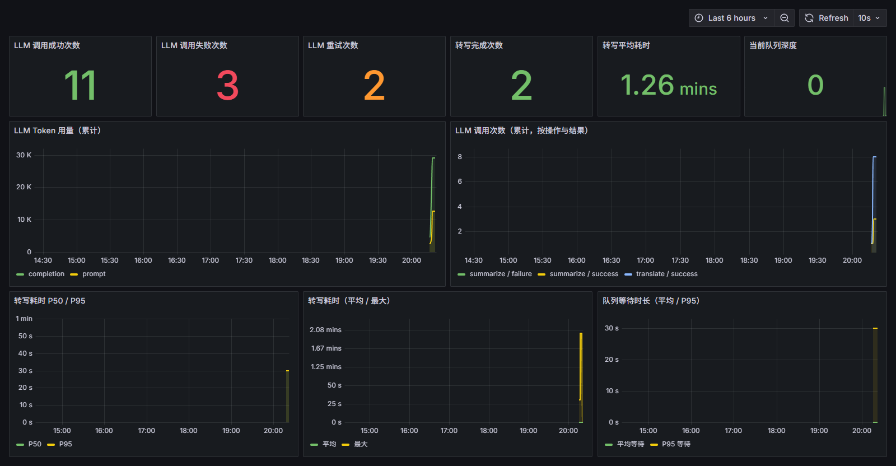
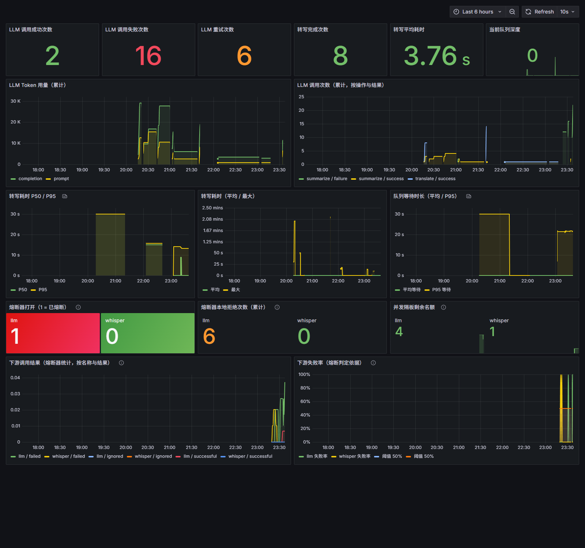

# 本地视频 AI 解析工作台

面向内容创作者的**本地化**视频 AI 解析工作台。导入视频后自动完成音频抽取、语音转写与摘要/章节生成；
所有任务按账号隔离，登录后只能看到自己的任务。输出可跳转的带时间戳文稿。

设计上**视频与音频全程保留在本机**，仅将纯文本转写结果发送至云端内容服务，
兼顾隐私与成本；未配置云端密钥时，本地转写能力仍然完整可用。

## 项目职责与已验证成果

个人主要负责视频导入、任务编排、FFmpeg 音频抽取、Whisper 转写、LLM 结果校验、
结果导出及 Vue 前端接口联调，完成从上传到转写、播放定位和导出的后端核心流程与持久化设计。

- 设计 `IMPORT → AUDIO_EXTRACTION → TRANSCRIPTION → SUMMARY → COMPLETED` 分阶段任务流程，使用 MySQL 持久化任务状态和转写片段，使处理进度、失败信息和已有产物可被查询。
- 使用 `ProcessBuilder` 托管 FFmpeg，异步消费 stdout/stderr，并加入超时终止和退出码诊断，避免外部进程因管道缓冲区写满而阻塞；Whisper 改为常驻 HTTP 服务单独托管。
- 对 LLM 返回的摘要、要点和章节执行服务端业务校验，检查章节来源片段、时间范围、顺序与重叠，并用「引文逐字出自来源片段」的反幻觉闸门（`quote`）拦截编造内容，避免直接信任模型的输出。
- 在 2 个真实视频样本上完成本地转写验证：英文样本完整转写持久化 42 个带时间戳片段；中文样本（355.947 秒）持久化 250 个带时间戳片段，实测从上传到完成约 58 秒。英文样本的 Range 请求返回 `206 Partial Content`，Markdown、JSON、SRT 三种导出均成功。

上述耗时和片段数是样本结果，不代表通用准确率或并发性能；中文样本还发现 Whisper 尾部输出存在超出媒体时长的片段，当前记录为待进一步收敛的验证发现。

---

## 核心流程

```
视频导入 → 落库 QUEUED → 投递队列 → FFmpeg 音频抽取 → Whisper 语音转写 → 自动生成摘要/章节 → 结果校验 → 多格式导出
                                        │                    │                │
                                  16kHz 单声道      turbo 模型（容器内 CPU）  JSON 结构化输出   章节时间轴 + 引文校验
```

全链路图与关键取舍（ADR）见 [docs/架构与取舍.md](docs/架构与取舍.md)。

---

## 技术栈

| 层次        | 技术                                                                         |
| ----------- | ---------------------------------------------------------------------------- |
| 后端        | Java 21、Spring Boot 3.5、Spring JDBC、Maven                                 |
| 数据库      | MySQL 8 + Flyway 版本迁移                                                    |
| 消息队列    | RabbitMQ 4（持久化队列 + 手动 ack，幂等由数据库条件更新保证）                |
| AI / 音视频 | Whisper（turbo）、FFmpeg、LLM API（结构化输出）                              |
| 容错        | Resilience4j 2.3（并发隔板 + 熔断器，熔断状态可从 Actuator/Prometheus 观测） |
| 前端        | Vue 3、TypeScript、Vite、Element Plus                                        |
| 工程化      | JUnit、Spotless + google-java-format、Docker Compose                         |

---

## 技术要点

### 0. 前端按需加载

仅注册工作台实际使用的 Element Plus 组件、指令及样式，避免全量 UI 库进入首屏包。
当前生产构建产物为约 361 KB JavaScript 和 97 KB CSS（未压缩），用于降低本地工作台首次加载体积。

### 1. 异步任务编排与故障恢复

任务是**先落库为 `QUEUED`，再投递消息**：队列外置到 RabbitMQ（持久化队列 + 持久化消息 + 手动 ack），
消费端并发固定为 1、prefetch 为 1，用 `ConcurrentHashMap` 持有运行中的外部进程句柄，
以保护本地推理资源；处理完才确认，进程被杀时那条未确认的消息会被 broker 重新投递。

**幂等不靠队列，靠数据库**：真正执行前必须先把任务从 `QUEUED` 原子改成 `PROCESSING`
（`update ... where id=? and status='QUEUED' and cancelled=false`）。重复投递的第二次必然领不到，直接确认丢弃——
所以「broker 重投」「用户连点重试」「多实例同时消费」都只会真正处理一次。
队列不可用时任务保持 `QUEUED` 并提示稍后重试，不会假装已经入队；异步拒收由
`workbench_queue_publish_failures_total` 计数与 ERROR 日志暴露，不让任务「静默停在 QUEUED」。

**多实例靠租约，不靠「状态即锁」**：只有 `status` 一个字段时，第二个实例无法区分「这个 `PROCESSING` 是别人正在跑」
还是「持有者已经死了」，只能二选一——要么启动时抢别人的活，要么让崩溃的任务永远卡住。所以领取任务时会额外写入
`locked_by`（实例 id，来自 `WORKBENCH_INSTANCE_ID`，留空则用「主机名 + 随机后缀」）与 `lease_expires_at`：

- 持有者按 `WORKBENCH_LEASE_HEARTBEAT_MILLIS` 续**自己真正在跑**的任务（内存里记着 `held` 集合，
  被放弃的行不会被续到永不过期）；巡检线程按 `WORKBENCH_LEASE_SWEEP_MILLIS` 找 `lease_expires_at` 已过的行，
  收回并重投——迁移前遗留的 `lease_expires_at is null` 行按「已过期」处理，升级期间被中断的任务不会卡住。
- 优雅停机在 `@PreDestroy` 里 `releaseClaimsOwnedBy(实例 id)` **立刻**交还；被 `SIGKILL` 才走租约过期回收。
- 重试投递（`attempt > 1`）先看租约：只有当持有者是自己、或租约已过期时才就地放回 `QUEUED`，否则直接跳过，
  绝不抢别的实例正在跑的任务。
- 边界（如实说明）：回收的前提是持有者与数据库失联超过一个租约时长。若持有者其实还活着（只是网络分区），
  仍可能被回收并造成**一次重复执行**；彻底消除需要 fencing token，**当前未实现**。

**失败分流**：可重试的瞬时故障（Whisper 服务不可达 / 超时 / 5xx、数据库短暂不可达）不判死，而是投递到重试队列按
**指数退避**（默认 5s → 10s → 20s）再来一次，等待时间由消息自身的 TTL 承载——不占线程 sleep，进程重启也不会把等待中的重试丢掉。
超过 `WORKBENCH_QUEUE_MAX_ATTEMPTS`（默认 4）次后，消息进死信队列留档、任务在库里标为 `FAILED` 并写明重试次数与原因，
用户在界面上点「重试」即可人工重投（重新投递后从第 1 次算起）。
反过来，媒体损坏、FFmpeg 退出码非 0 这类「重试多少次都一样」的失败**不占用重试额度**，直接判失败；
代码缺陷等非瞬时异常同样直接进死信队列，避免反复撞同一堵墙。

任务按阶段推进，每个阶段独立可观测：

| 阶段               | 进度 | 说明                           |
| ------------------ | ---- | ------------------------------ |
| `IMPORT`           | 0%   | 视频导入与校验                 |
| `AUDIO_EXTRACTION` | 10%  | FFmpeg 抽取 16kHz 单声道音频   |
| `TRANSCRIPTION`    | 45%  | Whisper 转写并落库带时间戳片段 |
| `SUMMARY`          | 85%  | LLM 生成摘要、要点与章节       |
| `COMPLETED`        | 100% | 完成                           |

关键设计：

- **一次提交自动跑完**：上传后自动完成音频提取、转写与内容生成，转写结束即串联摘要与章节，无需手动触发；摘要阶段校验不通过会自动重新生成，最多 3 次。
- **重试边界**：已保留转写的任务可单独重试摘要；其他失败任务从本地处理重新开始。
- **重启恢复**：消息与队列都是持久化的，崩溃时未确认的消息由 broker 重投；服务启动时先回收**租约已过期**的任务
  （见上一节的租约机制）并把仍然 `QUEUED` 的任务重投，**再**开始消费——顺序反了会让重投的消息因为任务仍是 `PROCESSING` 而被白白确认。
  重投的消息本身靠 `claimForProcessing` 的条件更新兜底，重复的那几条会被判为重复投递直接丢弃。
  消息放进队列的环节由 `TaskService.recoverAfterRestart()` 与 `TaskQueueConsumer.start()` 共同保证。
- **产物一致性**：任务记录写入失败时回收刚上传的视频；删除任务时若本地视频或音频清理失败，则保留任务记录并返回错误，避免产生不可追踪的本地文件。
- **转写与摘要解耦**：未配置云端密钥时任务以「本地转写已完成」状态保留，
  配置后可单独重试内容生成，不丢失已完成的转写结果

### 2. 外部进程与服务托管

FFmpeg 由 `ProcessBuilder` 托管：

- **独立线程异步消费 stdout / stderr**：避免管道缓冲区写满导致子进程阻塞死锁
- **超时强杀**：超过配置时限自动 `destroyForcibly`
- **退出码诊断**：失败时截取 stderr 尾部作为错误信息回传前端

Whisper 推理是独立运行的常驻 HTTP 服务（`workers/whisper_worker.py --serve`），后端只通过 HTTP 调用它；
它现在跑在 compose 的 `whisper` 容器里，不再依赖宿主机上手工维护的 Python venv：

- **进程不再「悄悄死掉」**：容器退出由 `restart: unless-stopped` 拉起，健康检查打 `GET /health`；
  由于模型是在绑定端口**之前**加载的，`healthy` 的含义是「设备就绪且模型已加载」，
  而不只是「端口还活着」。宿主机 venv 时代那种后端报 `ConnectException` 的情况，现在对应一次自动重启。
- **镜像与模型分离**：镜像只装 Python + torch + whisper，模型权重靠挂载复用
  （默认 `./models/whisper`，可用 `WHISPER_MODELS_DIR` 指向已有缓存目录），不为 1.6GB 权重打包镜像；
  目录为空时首次启动会在容器内下载 `turbo` 权重。
- **CPU 兜底、GPU 可选**：默认装 CPU 版 torch，镜像不依赖 NVIDIA 容器运行时，`/health` 会如实返回
  `device=cpu`；要 GPU 就用 `--build-arg` 换成 CUDA 版 torch 再给容器加 GPU 预留（见 `workers/Dockerfile` 顶部注释）。
- **转写串行**：`/transcribe` 在 worker 内用锁串行执行。容器化之前实测两个后端实例同时向同一个 GPU 发转写，
  直接 `CUDA out of memory` 返回 500；现在并发请求排队，而不是互相抢显存（CPU 下也避免互相抢核）。
- **调用鉴权**：请求头携带 `X-Whisper-Token`，与后端共享密钥；服务启动时强制要求该密钥
  至少 32 字符，避免本机其他进程随意调用
- **设备自述**：`GET /health` 返回当前推理设备（`cuda` / `cpu`）与模型名，便于确认是否退化到 CPU
- **输入边界**：按 `Content-Length` 分块落盘并限制体积，超限返回 `413`；转写结束后删除临时音频
- **模型只加载一次**：按 `(模型名, 设备)` 缓存已加载的权重，去掉「每个请求重新加载模型」的开销；
  模型文件缺失或损坏会在启动阶段就失败并暴露出来，而不是每次转写都返回 500

### 3. LLM 结构化输出与可信校验

大模型的输出不可全信，尤其是时间轴，以及「看起来像原文」的引文。因此：

- 约束模型返回 JSON：`{summary, keyPoints[], chapters[{startMs, endMs, title, sourceSegmentId, sourceEndSegmentId, quote}]}`。章节可覆盖连续转写片段，首尾片段 ID 用于服务端时间范围校验；`quote` 是该章节所引用片段的**转写原文原句**。
- **JSON Schema 单一来源**：三种响应（摘要、跨块合并、翻译）的 schema 都定义在 `LlmJsonSchema`，同一份 schema 原文既**写进提示词**约束模型，也用于**服务端本地机械校验**，不会出现「提示词说的」与「校验查的」两张皮。本地校验按 `$..` JSON 路径逐条报出「缺少必填字段」「期望 string，实际为 number」，而不是只判断顶层字段是不是 `null`。
- **供应商能力是实测出来的，不是假设的**：DeepSeek 官方 API 目前**不支持**原生结构化输出——实测 `response_format={"type":"json_schema",...}` 返回 `400 This response_format type is unavailable now`，强制 function calling（`tool_choice`）返回 `400 Thinking mode does not support this tool_choice`，只有 `response_format={"type":"json_object"}` 返回 200。因此这里采用「`json_object` 保证一定是合法 JSON + 提示词内 schema 原文 + 本地 schema 校验」的组合，并把空内容、非法 JSON、结构不符三类都计入 `workbench.llm.output_failures` 指标，失败率可直接从指标读出。
- **模型降级链**：主模型（`LLM_MODEL`，默认 `deepseek-v4-flash`）在**超时、HTTP 报错或输出结构不可用**时，自动升级到备用模型（`LLM_FALLBACK_MODEL`，默认 `deepseek-v4-pro`）重试一次，降级按原因打点 `workbench.llm.fallbacks` 并记 WARN 日志（含模型名与原因），可用 `LLM_FALLBACK_MODEL=` 关闭。主模型失败与备用模型成功的调用**分别记账**，成功率不会被降级掩盖。
- 每个章节**必须声明其起始和结束来源转写片段 id**；单片段章节的两个 id 相同
- 服务端逐条校验：
  - **时间轴**：章节时间必须分别落在首、尾来源片段的起止范围内，尾片段不得早于首片段，章节时间不得与上一章节重叠、标题非空
  - **反幻觉闸门（quote）**：`quote` 非空，且**归一化后**（去掉空白与中英文标点）必须连续出现在 `sourceSegmentId..sourceEndSegmentId` 覆盖片段的转写原文里；不匹配即判定为模型编造，抛错并触发重试。比较的是完整引文的连续包含，不做前缀 / 关键字 / 编辑距离等宽松匹配
- **分块与合并**：转写按 `LLM_MAX_INPUT_CHARS` 分批。**分块数 > 1 时**，summary 与 keyPoints 额外发起一次「合并去重」调用（要求模型只返回 `{summary,keyPoints[]}`）；chapters 由各块结果**确定性合并排序**，不交给模型重写，以免破坏 `sourceSegmentId` 引用与时间校验。
- **要点不截断**：keyPoints 按「去首尾空白 + 去尾部标点」归一化后去重；数量超过 12 条（继承自旧截断值的宽松告警阈值）只打日志告警，**绝不静默丢弃**。
- 校验失败则整体失败并可重试，且**把上一次的失败原因回灌到提示词**（同一个提示词重试大概率仍是同样的幻觉，带上原因才有意义），最多 3 次；**本地转写结果始终保留**。
- 非中文视频在转写后自动生成中文译文，便于与摘要对照阅读

这样既获得了大模型的表达能力，又不把时间轴与引文的正确性交给模型。

### 4. 视频流式播放

手写 HTTP Range 处理，基于 `FilterInputStream` 对响应体精确限流，
返回 `206 Partial Content` 与 `Content-Range` 头，
支撑前端播放器拖拽跳转，并与转写片段的时间轴双向联动定位。

### 5. 结果导出

支持三种格式导出：**Markdown**（摘要 + 要点 + 带时间戳全文）、
**JSON**（完整任务数据）、**SRT**（标准字幕格式，可直接用于视频压制）。

另有单视频 LLM 成本导出 `GET /api/tasks/{id}/cost`（见「提示词版本化与成本核算」）。

### 6. 账号鉴权与任务归属

自建注册/登录（BCrypt 存密码）+ 无状态 JWT，所有 `/api/tasks/**` 接口都需要令牌：

- **身份来源**：`Authorization: Bearer <token>`；视频流与导出由浏览器直接打开，
  无法附加请求头，因此这两类接口额外接受 `?access_token=` 查询参数
- **归属强约束**：`tasks.owner_id` 非空并建索引，列表查询在 SQL 层按 `owner_id` 过滤，
  按 id 的读写统一走 `where id=? and owner_id=?`，不匹配一律返回 `403`（不区分“不存在”与“不属于你”，避免探测）
- **状态码语义**：未携带/携带无效令牌返回 `401`，跨账号访问他人任务返回 `403`
- **前端行为**：令牌存 `localStorage`，401 时自动清除并回到登录页
- **历史数据**：鉴权上线前的无主任务在迁移中回填给种子账号 `demo`，已有转写与摘要数据保留

### 7. 列表游标分页

任务列表按 `created_at desc, id desc` 稳定排序，用 `(created_at, id)` 元组做**键集比较**（keyset，不用 OFFSET），
避免大列表下翻页随深度变慢，也避免翻页途中有新任务插入时出现重复或漏项：

- `GET /api/tasks?cursor=<opaque>&limit=<n>`：`limit` 可选，默认 20、上限 100；`cursor` 省略表示第一页。
- 响应体为 `{"items":[...],"nextCursor":"..."}`；`nextCursor` 为 `null` 表示没有更多数据，前端拿它请求下一页。
- 游标对客户端不透明，内部是 `base64url(毫秒时间戳|任务 id)`；时间戳固定毫秒精度，与
  `tasks.created_at timestamp(3)` 一致，避免读出的时间被截断后跳过同一时间戳内的任务。
- `limit` 非数字、≤0 或 >100，以及 `cursor` 非法（base64 无法解析、缺少字段、时间戳不合法）都返回 `400`，
  不会静默当成第一页；游标仍在 SQL 层叠加 `owner_id` 过滤，无法借此读到其他账号的任务。

### 8. 提示词版本化与成本核算

提示词不是写死在代码里的字符串，而是会反复迭代、需要按版本比较效果与成本的产物：

- **提示词版本化**：正文放在 `resources/prompts/<名称>.<版本>.system.txt` 与 `.user.txt`
  （当前 `summarize.v1` / `merge.v1` / `translate.v1`），代码只负责注入 schema 原文、输入文本与「上次失败原因」。
  资源缺失或占位符没被赋值**启动即失败**，不允许线上出现「提示词少了一半」的静默降级；
  改措辞就换版本号，评测集与成本都按版本归属，可以直接对比。
- **调用账目落库**：每次 LLM 响应里的 `usage` 都写进 `llm_calls` 表，记下
  **任务 id + 提示词版本 `prompt_id` + 实际服务的 `model` + prompt/completion token 数**。
  记「实际服务的模型」而不是「配置的主模型」，降级到备用模型的调用才会如实归到备用模型名下。
- **成本折算**：单价必须由使用者通过 `LLM_PRICES` 显式配置，格式
  `模型:每百万输入token单价:每百万输出token单价`（多条用逗号分隔）。**仓库不内置任何价格**——
  价格随账号、区域与调价变动，写死在仓库里迟早变成过期数字，还会让「成本」看起来像官方结论。
  未配置单价的模型只给 token 数、金额为 `null`，不做「按同价估算」的兜底；配置格式非法在启动时直接失败。
- **成本导出**：`GET /api/tasks/{id}/cost` 按 `prompt_id + model` 分行返回用量与金额；
  任一行缺单价时总额为 `null`（部分缺失不给总数，避免把残缺数据算成一个看起来完整的数字）。
- **记账不拖垮主流程**：写账失败只记 WARN，不让一次已经成功的摘要生成因为记账失败而变成失败。

```jsonc
// GET /api/tasks/f1094e67-…/cost（容器实测，LLM_PRICES=deepseek-v4-flash:0.28:0.42）
{
  "taskId": "f1094e67-33da-4038-9935-25557bc50288",
  "currency": "USD",
  "promptTokens": 8365,
  "completionTokens": 18947,
  "estimatedCost": 0.0103,
  "lines": [
    {
      "promptId": "summarize.v1",
      "model": "deepseek-v4-flash",
      "calls": 1,
      "promptTokens": 3551,
      "completionTokens": 4758,
      "estimatedCost": 0.002993
    },
    {
      "promptId": "translate.v1",
      "model": "deepseek-v4-flash",
      "calls": 14,
      "promptTokens": 4814,
      "completionTokens": 14189,
      "estimatedCost": 0.007307
    }
  ]
}
```

跨版本对比直接查表即可（`prompt_id` + `model` 上建有索引）：

```sql
select prompt_id, model, count(*) calls,
       sum(prompt_tokens) prompt_tokens, sum(completion_tokens) completion_tokens
from llm_calls group by prompt_id, model order by prompt_id, model;
```

---

### 9. 下游调用的容错治理

LLM 与 Whisper 都是「会挂、会慢、会被限流」的外部依赖，靠调用方自己控节奏：

- **并发隔板 + 熔断器**（Resilience4j）：`DownstreamResilience` 统一封装，顺序是
  **隔板（外）→ 熔断器（内）→ 真实调用**。隔板在最外层，被隔板拒绝的调用不会记进熔断器的失败率——
  否则「本地并发满」会被误判成「下游故障」，把熔断器白白推向打开。
  隔板 `max-wait-duration: 0` 即**不排队、直接拒绝**，这就是「下游挂掉时快速失败而不是堆积线程」的实现方式。
- **超时由 HTTP 客户端强制**：`workbench.llm.timeout-seconds`（默认 90s）/`translate-timeout-seconds`（默认 180s）
  作用于 JDK `HttpRequest.timeout`；Whisper 用 `WORKBENCH_PROCESS_TIMEOUT_MINUTES`。
- **刻意不叠 Resilience4j 的 Retry 与 TimeLimiter**：重试已经有三处明确归属（模型降级链 flash→pro、
  任务内 3 次重新生成、队列指数退避），再套一层会叠加放大；TimeLimiter 只能让调用方提前返回、
  藏不住仍在跑的请求，交给 HTTP 客户端强制更诚实。理由写在 `DownstreamResilience` 的注释里。
- **不注册熔断器健康指示器**：熔断打开说明下游不健康，不代表本进程该被重启；
  算进 `/actuator/health` 会让容器健康检查失败、被编排反复重建，反而扩大故障面。
- **拒绝即瞬时故障**：被熔断器或隔板拒绝的调用在 `LlmClient` 里转成
  `TransientFailure("llm_unavailable")`（Whisper 侧为 `whisper_unavailable`），
  任务回到 `QUEUED` 走 P2-2 的指数退避——容错和重试是接上的，不是两套互不相干的机制。

```text
# 实测：注入不可达的 LLM 地址后的日志与熔断状态（连接被拒，未发出请求）
WARN  LlmClient     - 模型 deepseek-v4-flash 调用失败（io_error）：；降级到 deepseek-v4-pro   ← 前 5 次真的发出去了
WARN  TaskService   - 任务处理遇到瞬时故障，等待退避重试：taskId=6493bbed-… reason=llm_unavailable
WARN  TaskQueueConsumer - 任务处理遇到瞬时故障，5000 ms 后进行第 2 次尝试：reason=llm_unavailable
                        detail=内容服务熔断器已打开或并发已满（CallNotPermittedException），本次未发起请求
ERROR TaskQueueConsumer - 任务已达重试上限 4 次，转入死信队列：reason=llm_unavailable

{"circuitBreakers":{"llm":{"failureRate":"100.0%","bufferedCalls":5,"failedCalls":5,
  "notPermittedCalls":3,"state":"OPEN"}, …}}
```

Whisper 侧的时间证据更直观：真实失败要等满 **10s** 连接超时，熔断之后第 4 次尝试距离上一条日志只有 **0.1s**
（这点时间只够 ffmpeg 抽音频），请求根本没发出去。完整数据与两种结局的差异见
[docs/端到端验收记录.md](docs/端到端验收记录.md)。

### 10. 接口容量与瓶颈

压测脚本在 `ops/k6/`：`query.js` 只读（列表 / 详情 / 明细按 7:2:1 混合、阶梯加压），`upload.js` 以恒定速率
投递同一个真实短视频。k6 用官方镜像跑在 compose 网络里，不需要额外安装：

```powershell
# 读接口：100 → 400 次/秒 阶梯加压，每段 30s
docker run --rm --network toni-2_default -v "$PWD/ops/k6:/scripts" -w /scripts `
  -e BASE_URL=http://backend:8080 -e RESULT_NAME=query-high -e READ_START=100 -e READ_TARGETS=200,300,400,400 `
  grafana/k6 run query.js
# 上传接口：恒定 2 次/秒，压的是 48 KB 的 4 秒真实片段（fixture 生成命令见脚本顶部注释）
docker run --rm --network toni-2_default -v "$PWD/ops/k6:/scripts" -w /scripts `
  -e BASE_URL=http://backend:8080 -e UPLOAD_RATE=2 -e UPLOAD_DURATION=30s -e RESULT_NAME=upload `
  grafana/k6 run upload.js
```

下表是客户端观测到的延迟（毫秒），两轮读压测各跑 120 秒、到达速率逐段爬升，`k6` 报告**零**丢弃迭代、
零失败请求：

| 接口                                  | 到达速率      | 请求数 | 失败 | avg   | p95   | p99   | max   |
| ------------------------------------- | ------------- | ------ | ---- | ----- | ----- | ----- | ----- |
| `GET /api/tasks?limit=20`（列表）     | 20→120 次/秒  | 6493   | 0    | 2.13  | 2.96  | 4.20  | 10.73 |
| `GET /api/tasks/{id}`（详情）         | 20→120 次/秒  | 1869   | 0    | 1.96  | 2.77  | 4.14  | 6.40  |
| `GET /api/tasks/{id}/details`（明细） | 20→120 次/秒  | 937    | 0    | 2.88  | 4.15  | 5.51  | 14.68 |
| 列表（高档）                          | 100→400 次/秒 | 24222  | 0    | 1.50  | 1.91  | 2.25  | 6.15  |
| 详情（高档）                          | 100→400 次/秒 | 6846   | 0    | 1.36  | 1.76  | 2.06  | 6.07  |
| 明细（高档）                          | 100→400 次/秒 | 3432   | 0    | 2.11  | 2.75  | 3.13  | 6.32  |
| `POST /api/tasks`（上传，20s）        | 恒定 2 次/秒  | 40     | 0    | 11.90 | 14.66 | 17.15 | 18.57 |
| `POST /api/tasks`（上传，30s）        | 恒定 2 次/秒  | 61     | 0    | 10.78 | 14.84 | 18.19 | 20.65 |

同一时段的容器资源（`docker stats` 采样，CPU 是单核口径）：backend **37–48%**、557 MiB；
mysql **14–17%**、199 MiB；whisper 空载 0.01%、3.37 GiB。数据库连接池上限 10 条，压测期间
`hikaricp_connections_pending` 全程为 **0**。

服务端侧也对照过一遍：同一档 200 次/秒下 `/actuator/prometheus` 直方图算出的 P95 是
列表 **2.05 ms** / 详情 **1.83 ms** / 明细 **3.02 ms**，比客户端观测低约 1 ms，
差的这部分来自容器端口映射与 k6 自身（`management.metrics.distribution.percentiles-histogram.http.server.requests`
此前没有开，Timer 只导出 `_count/_sum/_max`、`histogram_quantile` 会返回空，这次一并打开）。

**瓶颈分析**：

- **读接口没压出拐点**。400 次/秒下 p95 仍只有 2 ms 左右，连接池没有等待、CPU 也没打满。
  本机是 k6 与被压服务同机（Docker Desktop / WSL2），再往上加压客户端自己先成为瓶颈，
  所以这里**不给「最大 QPS」这个数字**，只给「该速率下的延迟」。
- **上传的接收路径很便宜**：一次落盘 + 一条 insert + 一次投递，p95 约 15 ms，与文件大小基本无关
  （压的是 48 KB 片段，上限 `MAX_UPLOAD_BYTES` 默认 2 GiB）。它是异步接口，**不承担下游处理时间**。
- **真正的瓶颈在处理侧，且不在同一个量级**。三条叠加：进程内消费者 `concurrency=1` + `prefetch=1`、
  Whisper 容器内串行、每个任务还要一次摘要加若干次翻译调用。实测上传 2 次/秒跑 30 秒产生 61 个任务，
  加上前一轮 40 个，broker 积压从 0 线性涨到 **97**；同期消费侧排空速率约 **2 个/分钟**
  （`16:01:33` 完成 3 个 → `16:02:37` 完成 5 个），**接收能力是处理能力的 60 倍以上**。
- **Whisper 的每次调用有固定开销**：4 秒片段在容器里也要约 **10 s**（进度条 `401/401 frames`、
  `39–40 frames/s`），而早前 40 秒样本是 32.5 s——所以「上传更小的文件」并不能显著提高单位时间任务数。
- 因此系统的表现是**接口永远很快、积压线性增长**：当前**没有背压也没有拒绝策略**
  （`importVideo` 只受大小限制），积压由 broker 持久化保护、不会丢，但会一直堆到人工干预。
  这条已经写进 [当前不支持与下一步](#当前不支持与下一步)。

如实记录边界：一是单机同机压测，客户端与服务端抢同一份 CPU，数字不能外推为生产容量；
二是上传场景只压接收路径、不含转写，**不是端到端 QPS**；三是没做长时间稳定性（soak）与读写混合压测，
两轮读压测与上传轮次是分开跑的；四是排空曲线只覆盖约 100 秒，剩余积压由清理脚本删除（`DELETE /api/tasks/{id}`）。
完整命令、采样脚本 `ops/k6/sample-queue.ps1` 与原始结果见 [docs/开发验证.md](docs/开发验证.md)。

### 11. 实时推送与分片上传

- **任务进度不再轮询**：`TaskRepository` 每次写完任务状态都会调 `TaskEventStream.taskChanged(taskId)`，
  `GET /api/tasks/stream`（SSE）把「有变化」这个信号推给该任务的归属人。推的是**任务号而不是整行数据**——
  客户端收到后按自己已鉴权的接口重新取数，推送通道因此不必再造一套归属校验与序列化，
  也不会把别的账号的内容带到某个连接上。没有订阅者时连归属人都不会去查，原有处理路径的开销不变；
  连接 30 分钟到期后关闭，由浏览器自动重连。
- **前端**删掉了 3 秒轮询，改为 `EventSource` + 120ms debounce 合并刷新（一次上传会连续写好几次状态，
  合并后只发一次列表请求）；`onopen` 补刷一次，`onerror` 退回一次主动刷新兜底。
- **上传按 5 MiB 分片**：`POST /api/tasks/uploads` 先声明文件名与大小，服务端用
  `sha256(ownerId + 文件名 + 大小)` 的前 16 字节当 `uploadId`——**重选同一个文件必然得到同一个 id**，
  续传因此对客户端是无状态的（不必自己记住上次传到哪）。分片可以乱序到达，按偏移直接写进 `data.part`，
  **写完才建 `chunk-N.done` 标记**（标记最后写，所以「有标记」等价于「这片已落盘」）；
  `complete` 校验分片齐全且文件大小等于声明值之后才登记任务。
- **进度存在文件系统**（`storage/uploads/<uploadId>/`），不额外建表，进程重启后进度还在；
  访问别人的会话按 `meta.properties` 里记录的归属人判定并返回 `403`，不靠「id 猜不到」兜底。
  前端分片走 XHR 而不是 `fetch`——上传方向的进度事件目前只有 XHR 提供。

```powershell
npm run verify:realtime-upload   # 浏览器端：空闲 8s 零轮询 + 推送驱动的阶段变化 + 限速上传看进度条
npm run verify:sse               # 推送延迟与账号隔离：6 次全部对账，min 5 ms / 中位 7 ms / max 9 ms
```

如实记录边界：一是**推送没有心跳**，中间代理按空闲超时断开时，客户端要等浏览器自己发现断链才重连，
期间的变化靠 `onerror` 时的一次主动刷新兜底、不是实时；二是**半截上传没有 TTL 清理**，
用户传一半关页面会留下 `storage/uploads/<id>/` 占着磁盘；三是续传只按「同名同大小」判定、**不做内容校验**，
要严格得把内容哈希纳入 `uploadId`；四是 SSE 是**单实例内存态**，多实例部署时推不到连在别的实例上的浏览器。
详见 [docs/端到端验收记录.md](docs/端到端验收记录.md)。

---

## 项目结构

```
.
├── backend/                         # Spring Boot 后端
│   └── src/main/
│       ├── java/ai/toni/videoworkbench/
│       │   ├── TaskController.java       # REST 接口（鉴权后按账号隔离）
│       │   ├── TaskService.java          # 任务编排与外部进程托管
│       │   ├── TaskEventStream.java      # 任务变化推送通道（SSE，按归属人分发）
│       │   ├── ChunkedUploadService.java # 分片上传会话与断点续传（进度存文件系统）
│       │   ├── TaskQueue.java            # 任务队列接口（投递 + 队列不可用异常）
│       │   ├── RabbitTaskQueue.java      # RabbitMQ 实现（持久化投递、确认打点、broker 侧深度）
│       │   ├── TaskQueueConfig.java      # 队列 / 死信 / 重试拓扑声明
│       │   ├── TaskQueueConsumer.java    # 消费端（手动 ack、等待计时、启动时机受控）
│       │   ├── TaskRepository.java       # JDBC 数据访问（读写强制带 owner）
│       │   ├── TaskCursor.java           # 列表游标编解码（不透明 keyset 游标）
│       │   ├── TaskPage.java             # 任务列表分页响应
│       │   ├── SecurityConfig.java       # Spring Security 过滤链与密码编码器
│       │   ├── JwtService.java           # JWT 签发与校验
│       │   ├── JwtAuthenticationFilter.java # 从请求中解析令牌并建立身份
│       │   ├── AuthController.java       # 注册 / 登录接口
│       │   ├── UserRepository.java       # 用户数据访问
│       │   ├── LlmClient.java            # LLM 调用（摘要 / 翻译，解析 usage 并落库）
│       │   ├── LlmUsageRepository.java   # LLM 调用账目（提示词版本 / 模型 / token）
│       │   ├── LlmCostService.java       # 按提示词版本与模型折算单视频成本
│       │   ├── LlmPricing.java           # 模型单价解析（LLM_PRICES，仓库不内置价格）
│       │   ├── TaskCost.java             # 单视频成本导出响应
│       │   ├── PromptLibrary.java        # 提示词唯一来源（带版本号的资源文件）
│       │   ├── LlmJsonSchema.java        # JSON Schema 唯一来源（正文在 resources/schemas）
│       │   ├── WorkbenchMetrics.java     # 指标埋点集中入口（Micrometer）
│       │   ├── ResultValidator.java      # 章节时间轴与引文可信校验
│       │   ├── ExportService.java        # Markdown / JSON / SRT 导出
│       │   └── TaskRecovery.java         # 重启后任务恢复
│       └── resources/
│           ├── application.yml
│           ├── prompts/                  # 带版本号的提示词：<名称>.<版本>.<system|user>.txt
│           ├── schemas/                  # JSON Schema 正文（Java 服务端与 Node 评测脚本共用）
│           └── db/migration/             # Flyway 迁移脚本
├── frontend/                        # Vue 3 + TypeScript 工作台界面
├── workers/                         # Whisper 推理服务
│   ├── Dockerfile                        # 服务镜像：默认 CPU 版 torch，可用 build args 换 CUDA
│   └── whisper_worker.py                 # HTTP 服务（/transcribe 与 /health），转写串行 + 模型缓存
├── ops/                             # 可观测性栈配置与压测脚本
│   ├── prometheus/prometheus.yml         # 抓取 backend:8080/actuator/prometheus
│   ├── grafana/                          # 数据源与面板 provisioning（含面板 JSON）
│   └── k6/                               # 压测：query.js（只读）/ upload.js（上传）/ sample-queue.ps1（采样）
├── tools/                           # 真实调用与推送实测脚本（eval-live.mjs / sse-latency.mjs）
├── verify-realtime-upload.mjs       # 浏览器端验收（Playwright）：零轮询 + 推送驱动 + 上传进度
├── docs/                            # 需求说明、编码规范、验收记录、面板截图
└── compose.yaml                     # Whisper / MySQL / RabbitMQ / 后端 / 前端 / Prometheus / Grafana
```

---

## REST 接口

除 `/api/auth/**` 外，所有接口都需要 `Authorization: Bearer <token>`；
未携带或令牌无效返回 `401`，访问他人任务返回 `403`。

| 方法     | 路径                                           | 说明                                                |
| -------- | ---------------------------------------------- | --------------------------------------------------- |
| `POST`   | `/api/auth/register`                           | 注册并返回令牌                                      |
| `POST`   | `/api/auth/login`                              | 登录并返回令牌                                      |
| `GET`    | `/api/tasks?cursor=&limit=`                    | 当前账号的任务列表（游标分页）                      |
| `POST`   | `/api/tasks`                                   | 导入视频（multipart 一次性上传）                    |
| `GET`    | `/api/tasks/stream`                            | 任务变化推送（SSE，令牌走 `access_token` 查询参数） |
| `POST`   | `/api/tasks/uploads`                           | 建立或继续分片上传会话（声明文件名与大小）          |
| `GET`    | `/api/tasks/uploads/{uploadId}`                | 查询会话已收到的分片                                |
| `PUT`    | `/api/tasks/uploads/{uploadId}/chunks/{index}` | 提交一片（`application/octet-stream`）              |
| `POST`   | `/api/tasks/uploads/{uploadId}/complete`       | 收齐后登记成任务                                    |
| `GET`    | `/api/tasks/{id}/details`                      | 任务详情（含转写与摘要结果）                        |
| `GET`    | `/api/tasks/{id}/cost`                         | 单视频 LLM 用量与成本（按提示词版本分行）           |
| `POST`   | `/api/tasks/{id}/cancel`                       | 取消任务                                            |
| `POST`   | `/api/tasks/{id}/retry`                        | 重试摘要或重新执行本地处理                          |
| `POST`   | `/api/tasks/{id}/retranscribe`                 | 重新转写                                            |
| `GET`    | `/api/tasks/{id}/video`                        | 视频流（支持 Range）                                |
| `GET`    | `/api/tasks/{id}/export/{format}`              | 导出 md / json / srt                                |
| `DELETE` | `/api/tasks/{id}`                              | 删除任务、视频及提取的音频                          |

`GET /api/tasks` 支持 `cursor`（不透明游标，省略即第一页）与 `limit`（默认 20、上限 100），
响应体为 `{"items":[...],"nextCursor":"..."}`，`nextCursor` 为 `null` 表示已到最后一页；详见上文「列表游标分页」。

`GET /api/tasks/stream` 是一次订阅、持续推送的 SSE 连接，推送内容只有任务号（`event: tasks` / `data: <taskId>`），
客户端据此重新取数；浏览器 `EventSource` 不能自定义请求头，所以这个端点额外接受 `access_token` 查询参数带令牌
（与 `/{id}/video`、`/{id}/export/{format}` 同一约定，其余接口仍只认 `Authorization` 头）。
分片上传的四个端点与 `POST /api/tasks` 是两条并存的路径：前者供前端大文件续传，后者保留给脚本与压测的单次提交。

---

## 统一错误响应与 traceId

所有接口的错误响应结构统一为 `{code, message, traceId}`，HTTP 状态码保持语义不变（400/401/403/405/409/413/429/500 等）：

```json
{
  "code": "FORBIDDEN",
  "message": "无权访问该任务",
  "traceId": "8f3c1a2b9d4e4f7799aabbccddeeff00"
}
```

- `code`：错误码枚举名（`INVALID_REQUEST` / `UNAUTHORIZED` / `FORBIDDEN` / `NOT_FOUND` / `METHOD_NOT_ALLOWED` / `CONFLICT` / `PAYLOAD_TOO_LARGE` / `INTERNAL_ERROR`），仅作粗分类，精确语义以 HTTP 状态码为准（例如队列不可用返回 `503`，`code` 落到 `INTERNAL_ERROR`）。
- `message`：面向用户的中文文案，前端直接展示。
- `traceId`：32 位十六进制追踪号。请求可携带 `X-Trace-Id`（`[A-Za-z0-9-]`，1-64 位）透传，否则由服务端生成；结果会回写到响应头 `X-Trace-Id`（成功响应也带）。

服务端内部异常只返回固定文案，不会把异常信息或堆栈泄漏到响应体，完整堆栈仅记录到后端日志。排查问题时，把响应里的 `traceId` 直接检索后端日志即可定位该次请求；日志格式已通过 `logging.pattern.console`（`%X{traceId:-}`）带上该追踪号。

---

## 可观测性

后端通过 Spring Boot Actuator + Micrometer 暴露运行指标，由 Prometheus 抓取、Grafana 看图。

### 端点

| 端点                                 | 说明                                                                      |
| ------------------------------------ | ------------------------------------------------------------------------- |
| `GET /actuator/health`               | 存活探针，容器 healthcheck 使用；`{"status":"UP"}`                        |
| `GET /actuator/prometheus`           | Prometheus 文本格式指标（JVM/HTTP 默认指标 + 下列自定义指标）             |
| `GET /actuator/circuitbreakers`      | 各熔断器的实时状态与计数（`state` / `failureRate` / `notPermittedCalls`） |
| `GET /actuator/circuitbreakerevents` | 熔断器状态变迁事件流（何时打开、何时半开、何时恢复）                      |

四个端点都在 `SecurityConfig` 中放行，**无需令牌**（取舍见本节末尾）。

### 自定义指标

埋点集中在 `WorkbenchMetrics`，业务代码只调它的方法、不直接依赖 `MeterRegistry`；标签刻意避开任务 id、文件名等高基数维度。

| 类别         | Micrometer 名                       | Prometheus 名                              | 含义                                                                                                                 | 标签                                                                                                 | 打点位置                           |
| ------------ | ----------------------------------- | ------------------------------------------ | -------------------------------------------------------------------------------------------------------------------- | ---------------------------------------------------------------------------------------------------- | ---------------------------------- |
| 转写耗时     | `workbench.transcription.duration`  | `workbench_transcription_duration_seconds` | 单条任务 Whisper 转写（含片段落库）耗时直方图                                                                        | `outcome=success/failure`                                                                            | `TaskService.transcribe`           |
| LLM 调用结果 | `workbench.llm.requests`            | `workbench_llm_requests_total`             | 每次 LLM HTTP 调用按结果计数                                                                                         | `operation=summarize/translate`、`outcome`                                                           | `LlmClient.send`（`finally` 记账） |
| LLM 重试次数 | `workbench.llm.retries`             | `workbench_llm_retries_total`              | 摘要生成在单条任务内首次之外的重试次数（最多 3 次尝试）                                                              | `operation`                                                                                          | `TaskService.generateContent`      |
| 模型降级次数 | `workbench.llm.fallbacks`           | `workbench_llm_fallbacks_total`            | 主模型失败后升级到备用模型的次数                                                                                     | `operation`、`reason=http_400/timeout/io_error/schema_violation/empty_content/invalid_json`          | `LlmClient.requestJson`            |
| 输出结构失败 | `workbench.llm.output_failures`     | `workbench_llm_output_failures_total`      | 模型输出不可用（空内容 / 非法 JSON / 不符合 schema）的次数，即结构失败率                                             | `operation`、`reason=empty_content/invalid_json/schema_violation`                                    | `LlmClient.callOnce`               |
| 校验拦截次数 | `workbench.llm.validation_failures` | `workbench_llm_validation_failures_total`  | 结果校验拦下未通过模型输出的次数（反幻觉闸门命中）                                                                   | `reason=quote_mismatch` / `quote_missing` / `invalid_chapter_*` 等                                   | `TaskService.generateContent`      |
| token 用量   | `workbench.llm.tokens`              | `workbench_llm_tokens_total`               | 从 LLM 响应 `usage` 字段累加的 token 数（同时落库到 `llm_calls`，见「提示词版本化与成本核算」）                      | `type=prompt/completion`、`model`                                                                    | `LlmClient.recordUsage`            |
| 队列深度     | `workbench.queue.depth`             | `workbench_queue_depth`                    | 当前排队等待处理的任务数（Gauge），读自 broker 的真实积压量；broker 不可达时为 `-1`                                  | 无                                                                                                   | `RabbitTaskQueue` 构造函数绑定     |
| 队列等待时长 | `workbench.queue.wait`              | `workbench_queue_wait_seconds`             | 任务从入队到真正开始执行的等待时长直方图（取消息 `timestamp`）                                                       | 无                                                                                                   | `TaskQueueConsumer.handle`         |
| 投递失败次数 | `workbench.queue.publish_failures`  | `workbench_queue_publish_failures_total`   | broker 确认（publisher confirm）未成功返回的次数                                                                     | 无                                                                                                   | `RabbitTaskQueue.publish`          |
| 退避重试次数 | `workbench.queue.retries`           | `workbench_queue_retries_total`            | 瞬时故障后安排退避重试的次数                                                                                         | `reason=whisper_unavailable/database_unavailable/llm_unavailable`、`attempt`（即将进行的第几次尝试） | `TaskQueueConsumer.retryLater`     |
| 死信任务数   | `workbench.queue.dead_letters`      | `workbench_queue_dead_letters_total`       | 超过重试上限、转入死信队列留档的任务数（需要人工处理）                                                               | `reason`                                                                                             | `TaskQueueConsumer.deadLetter`     |
| 任务领取结果 | `workbench.task.claims`             | `workbench_task_claims_total`              | 每次投递的领取结果，`claimed` 才算真正执行、`skipped` 是被判重复投递而丢弃；同一任务无论投递多少次只有一次 `claimed` | `result=claimed/skipped`                                                                             | `TaskService.process`              |
| 租约回收次数 | `workbench.task.lease_reclaims`     | `workbench_task_lease_reclaims_total`      | 租约过期被收回重投的任务数（持有者崩溃才会发生，用于观测失联与恢复）                                                 | 无                                                                                                   | `TaskLease.reclaimExpired`         |

下表的指标由 `resilience4j-micrometer` 自动导出，名字不是本项目起的，但它是判断「下游到底挂没挂」最直接的入口：

| Micrometer 名                                        | Prometheus 名                                           | 含义                                                                                                          | 标签                                                   |
| ---------------------------------------------------- | ------------------------------------------------------- | ------------------------------------------------------------------------------------------------------------- | ------------------------------------------------------ |
| `resilience4j.circuitbreaker.state`                  | `resilience4j_circuitbreaker_state`                     | 熔断器状态，`closed/open/half_open/disabled/forced_open/metrics_only` 各一条 Gauge，值 `1` 表示当前处于该状态 | `name=llm/whisper`、`state`                            |
| `resilience4j.circuitbreaker.calls`                  | `resilience4j_circuitbreaker_calls_seconds`             | 放行调用的耗时与结果（Summary，`_count` 即次数）                                                              | `name`、`kind=successful/failed/not_permitted/ignored` |
| `resilience4j.circuitbreaker.failure.rate`           | `resilience4j_circuitbreaker_failure_rate`              | 当前窗口内的失败率；`-1` 表示样本数还没到 `minimum-number-of-calls`，暂不判定                                 | `name`                                                 |
| `resilience4j.circuitbreaker.not.permitted.calls`    | `resilience4j_circuitbreaker_not_permitted_calls_total` | 被熔断器挡下、**没有发出请求**的调用数                                                                        | `name`、`kind=not_permitted`                           |
| `resilience4j.bulkhead.available.concurrent.calls`   | `resilience4j_bulkhead_available_concurrent_calls`      | 并发隔板剩余名额，降到 `0` 表示该下游并发已满、新调用会被本地拒绝                                             | `name`                                                 |
| `resilience4j.bulkhead.max.allowed.concurrent.calls` | `resilience4j_bulkhead_max_allowed_concurrent_calls`    | 并发隔板容量                                                                                                  | `name`                                                 |

- **熔断计数口径**：熔断器按**一次业务请求**（`requestJson`）计数，而一次 `requestJson` 内部主模型失败后还会再试备用模型，
  所以 `workbench_llm_requests_total{outcome="failure"}` 通常是 `resilience4j_circuitbreaker_calls_seconds_count{kind="failed"}`
  的 **2 倍**，两个数字不能混着读。判断「有没有真的打过去」要看 `not_permitted_calls_total` 是否增长、
  而 `workbench_llm_requests_total` 是否**停住**。
- **隔板饱和没有计数器**：Resilience4j 只导出剩余名额，不导出 rejected 计数，饱和只能靠
  `available_concurrent_calls` 归零来判断（已如实写进 README 限制）。
- **usage 解析**：`LlmClient` 原实现只取 `choices[0].message.content`，**并不解析 `usage`**；先前补上 `usage.prompt_tokens` / `usage.completion_tokens` 的读取并累加到指标，现在同一处还会按「任务 + 提示词版本 + 实际模型」写进 `llm_calls` 表，用于单视频成本导出。
- **队列深度来自 broker**：`WorkbenchMetrics.bindQueueDepth(Supplier<Number>)` 由 `RabbitTaskQueue` 注入数据源，用 `AmqpAdmin.getQueueProperties` 被动读取队列积压量。读不到时返回 `-1`（并在状态翻转时打一条 WARN），而不是回落成 `0`——把「broker 不可达」伪装成「队列为空」会让人误判系统健康。
- **投递失败只打点与记日志**：`publish` 抛异常时任务保持 `QUEUED` 并把错误提示交回调用方（导入接口返回 503，任务仍在），异步拒收（broker 收下了但未确认）只计 `workbench.queue.publish_failures` 并记 ERROR 日志，**不自动重投**，依赖服务启动时的恢复重投兜底（这个取舍在 README 限制里如实标明）。

### 启动与看图

```bash
docker compose up -d --wait      # backend / frontend / mysql / prometheus / grafana 全部 healthy
```

- Prometheus：<http://localhost:9090>，抓取任务 `video-workbench-backend`，目标 `backend:8080/actuator/prometheus`（容器网络内，无需令牌）。
- Grafana：<http://localhost:3000>，默认账号 `admin` / `workbench`（可用 `GRAFANA_ADMIN_USER`、`GRAFANA_ADMIN_PASSWORD` 覆盖）。数据源与面板均由 `ops/grafana/provisioning` 自动配置，面板 UID 为 `workbench-observability`。

面板覆盖上述主要指标：LLM 调用成功/失败/重试计数、转写完成次数与平均耗时、当前队列深度，以及 token 用量、LLM 调用次数、转写耗时 P50/P95、队列等待时长四条曲线，另有五个容错面板——熔断器打开、熔断器本地拒绝次数、并发隔板剩余名额、下游调用结果（按名称与结果）、下游失败率（带 50% 阈值线）。（较晚加入的「校验拦截」「模型降级」「输出结构失败」三个计数器尚未画进面板，可在 Prometheus 直接查询。）


上图来自一次**真实业务路径**：对已有任务触发 `retranscribe` 与 `retry` 后，`/actuator/prometheus` 中 `workbench_transcription_duration_seconds_count{outcome="success"}=2`、`workbench_llm_requests_total{operation="summarize",outcome="success"}=3`、`workbench_llm_tokens_total{type="prompt"}=12690`、`{type="completion"}=29117`，抓取瞬间 `workbench_queue_depth=2`。图中「LLM 调用失败次数」「LLM 重试次数」显示 `No data`，是因为这次运行确实没有失败或重试（该 Counter 只在首次发生时才注册）。为验证这两条路径，另做了一次**故障注入**：把 `LLM_API_KEY` 临时置为无效值后重试任务，得到 `workbench_llm_requests_total{outcome="failure"}=3`、`workbench_llm_retries_total{operation="summarize"}=2`，随后已恢复真实密钥：



下图是**熔断器打开时**的同一块面板（把容器 `LLM_BASE_URL` 指向连接立即被拒的地址后重试任务）：
从上往下第三行起是新增的容错面板，「熔断器打开」里 `llm` 为 `1`（红）、`whisper` 为 `0`（绿），
本地拒绝 `llm` 累计 6 次，隔板剩余名额 `llm 4 / whisper 1`，右下角失败率曲线打到 100% 并压在 50% 阈值线上：



压测那一轮的同一块面板（时间范围取最近 30 分钟，否则尖峰会被默认的 6 小时窗口压平）。最后一行
「接口容量（压测，P3-2）」从左到右是 HTTP 请求速率（按接口）、HTTP 延迟 P95/P99（按接口）、数据库连接池、
后端进程 CPU 与 JVM 堆、任务队列积压——队列积压那条线正是 P3-2 的结论：上传 2 次/秒期间积压线性涨到 **97**，
而读接口的延迟曲线保持平直：


复现截图：`npm run screenshot:grafana`（默认写入 `docs/可观测性面板.png`，可传文件名参数；
面板变多后截图需要更高的视口，可用 `GRAFANA_VIEWPORT_HEIGHT=1500` 覆盖默认的 660；
近窗口证据可用 `GRAFANA_RANGE_FROM=now-30m` 覆盖默认的 `now-6h`）。

### 鉴权取舍（如实说明）

`/actuator/health`、`/actuator/prometheus`、`/actuator/circuitbreakers` 与 `/actuator/circuitbreakerevents`
当前**未做鉴权**，任何能访问后端端口的人都能读取指标与熔断状态。
这是为了让 compose 网络内的 Prometheus 直接抓取而做的取舍：这些数据不包含视频内容或密钥，
但包含调用量、耗时、token 用量与队列状态等运营信息。**真实部署应把这些端点限制在内网**，
或用反向代理 / 抓取侧鉴权（如只允许 Prometheus 网段访问、加 Basic Auth），不要直接暴露到公网。

---

## 数据库结构

Flyway 自动迁移，共 5 张表：

- `users` —— 账号（用户名唯一、BCrypt 密码哈希）
- `tasks` —— 任务主表（状态、阶段、进度、错误信息、取消标记、归属账号 `owner_id`）
- `transcript_segments` —— 带起止毫秒的转写片段，含译文列
- `task_results` —— 摘要、要点 JSON、章节 JSON
- `llm_calls` —— LLM 调用账目（任务、提示词版本 `prompt_id`、实际模型 `model`、token 数），
  供单视频成本导出与按版本对比；建 `(task_id, created_at)` 与 `(prompt_id, model, created_at)` 两个索引

关联数据外键均为 `ON DELETE CASCADE`，删除任务时自动清理关联数据（含 `llm_calls`）；
`tasks.owner_id` 指向 `users(id)`，非空并建有 `(owner_id, created_at)` 索引。

---

## 快速开始

### Docker Compose 全容器启动

复制 `.env.example` 为 `.env`，至少设置 `MYSQL_USER`、`MYSQL_PASSWORD` 和 `MYSQL_ROOT_PASSWORD`，然后执行：

```bash
docker compose up -d --build
```

Compose 默认将容器 MySQL 映射到宿主机 `3307`，避免与其他项目占用 `3306` 冲突；后端容器内部仍通过服务名 `mysql:3306` 连接。

MySQL 用户和密码只会在空数据卷首次初始化时创建。如果已有旧卷是用其他账号初始化的，请先备份数据，再执行 `docker compose down --volumes` 后重新初始化，或进入 MySQL 手动创建 `.env` 中的 `MYSQL_USER` 并授权；不要为了测试随意删除包含重要视频/数据库的卷。

工作台访问 `http://localhost:5174`，后端访问 `http://localhost:8081`，Prometheus 访问 `http://localhost:9090`，Grafana 访问 `http://localhost:3000`，RabbitMQ 管理台访问 `http://localhost:15672`。Compose 会启动 Nginx 前端、Spring Boot 后端、MySQL 8.4、RabbitMQ 4、Whisper 转写服务以及 Prometheus / Grafana 可观测性栈；Whisper 也在容器里（默认 CPU 推理），端口映射到宿主机 `8090`。音视频保存在 `video-storage` 命名卷，MySQL 数据保存在 `mysql-data` 命名卷，队列消息保存在 `rabbitmq-data` 命名卷，Prometheus / Grafana 数据分别保存在 `prometheus-data`、`grafana-data` 命名卷；模型缓存在 `WHISPER_MODELS_DIR` 指定的宿主机目录（挂载进容器，不打进镜像）。端口可通过 `BACKEND_HOST_PORT`、`FRONTEND_HOST_PORT`、`WHISPER_HOST_PORT`、`PROMETHEUS_HOST_PORT`、`GRAFANA_HOST_PORT`、`RABBITMQ_HOST_PORT` 和 `RABBITMQ_MANAGEMENT_HOST_PORT` 修改。

停止容器但保留视频、模型和数据库：

```bash
docker compose down
```

结束本次测试并清空本项目数据库、视频、模型卷：

```bash
docker compose down --volumes --remove-orphans
```

仅清理本项目构建产生的悬空镜像和构建缓存：

```bash
docker image prune -f
docker builder prune -f
```

不要在日常停止服务时使用 `docker system prune --volumes`，它可能删除其他项目的未使用数据卷。

### 环境要求

- Docker（含 Compose v2）：Whisper 转写服务也在 compose 里，全栈一条命令起完
- Java 21、Node.js 20+（本机构建或直接跑后端/前端时需要）
- MySQL 8.0+、RabbitMQ 4（或直接用 `compose.yaml` 起这两个依赖）
- FFmpeg（容器内已装；仅在本机直接跑后端时才需要，可用 `FFMPEG_PATH` 指定）
- 本机 GPU 不是必需项：默认镜像跑 CPU，`/health` 会如实报告实际设备

### 1. 配置

```bash
cp .env.example .env
```

填写 `MYSQL_PASSWORD`、`MYSQL_ROOT_PASSWORD`、至少 32 字符的随机
`WHISPER_SERVICE_TOKEN` 与 `WORKBENCH_JWT_SECRET`；如需云端摘要能力，再填
`LLM_API_KEY`（不填也可完成本地转写）。

首次打开 `http://localhost:5174` 会进入登录页，可直接注册账号；迁移同时创建了
种子账号 `demo`（密码 `demo1234`，仅本地开发用），用于查看鉴权上线前的历史任务，
登录后请按需修改或改用自建账号。

Whisper 权重不打进镜像，挂载一个模型目录即可（已有缓存就直接指过去，省掉 1.6GB 重复下载）：

```properties
WHISPER_MODELS_DIR=E:/model/whisper
```

不设置时默认用仓库内的 `models/whisper`。目录里没有 `large-v3-turbo.pt` 时，
`whisper` 容器会在首次启动时把权重下载到该目录，`docker compose logs -f whisper` 可以看到进度。

### 2. 启动全部服务

```powershell
./start-all.ps1
```

脚本构建并启动 Compose 中的全部服务（Whisper、MySQL、RabbitMQ、Java 后端、前端、Prometheus、Grafana）。
后端会等到 Whisper 的 `/health` 通过（即模型加载完成）再启动，避免启动窗口里的任务白白消耗重试额度。
前端地址为 `http://localhost:5174`，后端为 `http://localhost:8081`，
Whisper 的设备信息可以用 `curl http://127.0.0.1:8090/health` 查看。
停止使用 `./stop-all.ps1`；不会删除模型或数据卷。

### 5. 运行测试与校验

```bash
./mvnw -f backend/pom.xml test          # JUnit
./mvnw -f backend/pom.xml verify        # 含 Spotless 代码风格校验
npm --prefix frontend run build         # vue-tsc 类型检查 + 生产构建
```

---

## 配置项

| 变量                                         | 默认值                | 说明                                                                                                                                     |
| -------------------------------------------- | --------------------- | ---------------------------------------------------------------------------------------------------------------------------------------- |
| `WORKBENCH_STORAGE_DIR`                      | `./storage`           | 视频、音频与模型文件的本机存放目录                                                                                                       |
| `WORKBENCH_MAX_UPLOAD_BYTES`                 | 20GB                  | 单个视频大小上限                                                                                                                         |
| `WORKBENCH_PROCESS_TIMEOUT_MINUTES`          | 180                   | 外部进程超时时间；首次下载模型时应保留充足时间                                                                                           |
| `RABBITMQ_HOST`                              | `localhost`           | 消息队列地址（compose 内为服务名 `rabbitmq`）                                                                                            |
| `RABBITMQ_PORT`                              | 5672                  | 消息队列端口                                                                                                                             |
| `RABBITMQ_HOST_PORT`                         | 5672                  | RabbitMQ 映射到宿主机的 AMQP 端口                                                                                                        |
| `RABBITMQ_MANAGEMENT_HOST_PORT`              | 15672                 | RabbitMQ 管理台映射到宿主机的端口                                                                                                        |
| `RABBITMQ_USERNAME`                          | `workbench`           | RabbitMQ 账号（compose 首次初始化时创建）                                                                                                |
| `RABBITMQ_PASSWORD`                          | 无（compose 必填）    | RabbitMQ 密码                                                                                                                            |
| `WORKBENCH_QUEUE_MAX_ATTEMPTS`               | 4                     | 瞬时故障最多尝试几次，用尽后进死信队列                                                                                                   |
| `WORKBENCH_QUEUE_RETRY_INITIAL_DELAY_MILLIS` | 5000                  | 首次重试前的退避时间（毫秒）                                                                                                             |
| `WORKBENCH_QUEUE_RETRY_MULTIPLIER`           | 2                     | 退避倍率：第 n 次失败后等待「初始延迟 × 倍率^(n-1)」                                                                                     |
| `WORKBENCH_INSTANCE_ID`                      | 空                    | 多实例认领用的实例标识。留空时用「主机名 + 随机 8 位后缀」；**同一时刻两个实例不能共用同一值**                                           |
| `WORKBENCH_LEASE_SECONDS`                    | 90                    | 任务租约时长（秒）。持有者崩溃后，超过这个时长且被巡检扫到才会被回收重投                                                                 |
| `WORKBENCH_LEASE_HEARTBEAT_MILLIS`           | 20000                 | 续租心跳间隔（毫秒），必须明显小于租约时长，否则自己的任务会被自己回收                                                                   |
| `WORKBENCH_LEASE_SWEEP_MILLIS`               | 30000                 | 过期租约巡检间隔（毫秒）。回收最坏延迟 ≈ 租约时长 + 巡检间隔                                                                             |
| `FFMPEG_PATH`                                | `ffmpeg`              | FFmpeg 可执行文件路径                                                                                                                    |
| `WHISPER_MODEL`                              | `turbo`               | Whisper 模型规格，`whisper` 容器启动时加载                                                                                               |
| `WHISPER_SERVICE_URL`                        | `http://whisper:8090` | 后端访问的 Whisper 地址（compose 内用服务名）                                                                                            |
| `WHISPER_MODELS_DIR`                         | `./models/whisper`    | 宿主机模型缓存目录，挂载到容器 `/models`                                                                                                 |
| `WHISPER_HOST_PORT`                          | 8090                  | `whisper` 服务映射到宿主机的端口，`/health` 可查设备                                                                                     |
| `WHISPER_CPU_THREADS`                        | 4                     | 容器内 CPU 推理线程数（`OMP_NUM_THREADS`）                                                                                               |
| `WORKBENCH_JWT_SECRET`                       | 无（必填）            | JWT 签名密钥，至少 32 字符，需自行随机生成                                                                                               |
| `WORKBENCH_TOKEN_TTL_HOURS`                  | 24                    | 令牌有效期（小时）                                                                                                                       |
| `LLM_API_KEY`                                | 空                    | 云端 LLM 密钥，留空则跳过摘要阶段                                                                                                        |
| `LLM_MODEL`                                  | `deepseek-v4-flash`   | 主模型                                                                                                                                   |
| `LLM_FALLBACK_MODEL`                         | `deepseek-v4-pro`     | 主模型失败/超时/结构不可用时升级到的备用模型，留空即关闭降级                                                                             |
| `LLM_MAX_INPUT_CHARS`                        | 60000                 | 单次摘要请求的字符上限，按完整转写片段分批                                                                                               |
| `LLM_PRICES`                                 | 空                    | 模型单价，格式 `模型:每百万输入token单价:每百万输出token单价`（逗号分隔多条）。留空则只统计 token，成本导出为 `null`；仓库不内置任何价格 |
| `LLM_PRICE_CURRENCY`                         | `USD`                 | 成本导出里的货币标记，随你填入单价的币种调整                                                                                             |
| `WORKBENCH_LLM_TIMEOUT_SECONDS`              | 90                    | 摘要/合并单次 LLM 请求的超时（秒），由 `HttpRequest.timeout` 强制                                                                        |
| `WORKBENCH_LLM_TRANSLATE_TIMEOUT_SECONDS`    | 180                   | 翻译单次 LLM 请求的超时（秒）；翻译输出比输入长，给更宽的上限                                                                            |
| `WORKBENCH_LLM_MAX_CONCURRENT`               | 4                     | LLM 并发隔板容量，超出直接拒绝（不排队）；置 0 会让所有 LLM 调用立即被拒                                                                 |
| `WORKBENCH_WHISPER_MAX_CONCURRENT`           | 1                     | Whisper 并发隔板容量，默认串行；worker 内部还会对 `/transcribe` 加锁，同时跑多个转写只会互相拖慢甚至 OOM                                 |
| `PROMETHEUS_HOST_PORT`                       | 9090                  | Prometheus 映射到宿主机的端口                                                                                                            |
| `GRAFANA_HOST_PORT`                          | 3000                  | Grafana 映射到宿主机的端口                                                                                                               |
| `GRAFANA_ADMIN_USER`                         | `admin`               | Grafana 管理员账号                                                                                                                       |
| `GRAFANA_ADMIN_PASSWORD`                     | `workbench`           | Grafana 管理员密码（仅本地开发默认值，请按需修改）                                                                                       |

> 密钥仅由后端读取，不会写入日志、前端响应或导出文件。

后端把提取好的 16kHz 单声道 WAV 上传到 compose 内的 `whisper:8090`，接口由 `WHISPER_SERVICE_TOKEN` 保护，
模型权重从宿主机目录挂载进来（`WHISPER_MODELS_DIR`）。镜像默认装 CPU 版 PyTorch，
所以 `/health` 返回 `device=cpu`；要 GPU 需自行用 `workers/Dockerfile` 顶部的 build args 重建为
CUDA 版 torch，并给服务加 GPU 预留（**默认不申请容器 GPU**：本机的 Docker Desktop 未必装了
nvidia-container-toolkit，装不上时容器会直接起不来，那种情况下退化成宿主机进程反而更稳）。
若首次下载因网络中断留下不完整的 `.pt` 文件，重试会重新校验并下载该模型；不要将未完成的文件当作已缓存模型。

---

## 验收情况

已通过真实验收：Maven 编译与 JUnit、前端 `vue-tsc` 与生产构建、
MySQL 8.4 隔离容器中 Flyway 迁移执行，以及 1 个真实视频的完整导入与 Whisper 转写
（持久化 42 个时间戳片段）、Range 请求返回 `206`、三种格式导出成功。

已验证边界场景：损坏视频、无音轨视频、取消与重启恢复；长文本已通过按完整转写片段分批和单片段超限拒绝校验。
鉴权与归属已在容器环境实测：无令牌与伪造令牌均返回 `401`；新注册账号调用任务列表、详情、视频流、导出、取消、删除访问种子账号的历史任务全部返回 `403`；迁移将原有 3 条无主任务回填给 `demo` 且 `owner_id` 已收紧为非空（`0` 条空值）；
前端从登录页到列表、注册新账号后列表为空的完整路径已通过浏览器验证。
中文真实视频已补充：输入 `E:\Downloads\Video\27210678708-1-192.mp4`，媒体时长 355.947 秒，H.264/AAC；本地 Whisper `turbo`、RTX 4060 Laptop GPU，上传到任务完成约 58 秒，持久化 250 个片段，任务保留为 `COMPLETED/SUMMARY` 并提示摘要可单独重试。检查发现尾部若干片段超出媒体时长，未将该样本表述为时间轴校验通过。以上数据仅对应样本，不能外推为通用成功率或准确率。

可观测性已在容器环境实测：`docker compose build backend` + `docker compose up -d --wait` 后五个服务全部 healthy；
对 `demo` 的已有任务触发 `retranscribe` / `retry`，`/actuator/prometheus` 出现自定义指标的非零样本
（转写耗时 `count=2`、LLM 调用成功、token `prompt=12690 / completion=29117`、队列深度抓取到 `2`、队列等待时长有样本），
Prometheus 目标 `video-workbench-backend` 为 `up`，Grafana 面板与数据源由 provisioning 自动加载；
额外用一次故障注入（临时失效 `LLM_API_KEY`）验证了 LLM 失败与重试路径。详见 [docs/端到端验收记录.md](docs/端到端验收记录.md)。

提示词版本化与成本核算同样在容器环境实测：`llm_calls` 表随 V4 迁移建立；对英文任务 `f1094e67-…` 触发一次
`retranscribe`（107 个转写片段），`GET /api/tasks/{id}/cost` 读出 `summarize.v1` 1 次调用与 `translate.v1` 14 次调用
（与 `ceil(107 / 8)` 的批次数一致）；未配置 `LLM_PRICES` 时金额为 `null` 而 token 照常统计，
临时注入**占位**单价 `deepseek-v4-flash:0.28:0.42`（仅为验证折算算术，不是任何官方报价）后金额为
`0.010300` = `0.002993`（摘要）+ `0.007307`（翻译），可由 token 数手工复核。后端 `mvnw verify` 通过：
`Tests run: 98, Failures: 0, Errors: 0, Skipped: 3`（3 项 MySQL 集成测试未配置 `MYSQL_TEST_URL` 时跳过），Spotless 通过。

任务队列外置到 RabbitMQ 后按计划的两条验收标准在容器环境实测：

- **重复投递只被消费一次**：把一条已完成任务在库里改回 `QUEUED/IMPORT`，在 **backend 停机期间**通过 RabbitMQ 管理 API
  `POST /api/exchanges/%2F/amq.default/publish` 向 `workbench.tasks` 直投 **3 条内容相同**的消息；
  启动后端后日志出现 **3 次**「任务已被领取或已结束，跳过重复投递」，加上启动恢复自己重投的 1 条共 4 条消息，
  该任务只被执行 1 次并最终 `COMPLETED`——重复投递与恢复重投都没有造成重复处理。
- **重启后任务不丢**：上面 3 条消息是在后端进程停止期间投递的，broker 持久化保存，后端重启后被正常消费，
  证明进程重启不会丢失已入队的任务。队列拓扑为 `workbench.tasks`（durable，1 个消费者）/ `workbench.tasks.retry` / `workbench.tasks.dead` 三个持久化队列。
- **长任务不被 broker 掐断**：RabbitMQ 默认 `consumer_timeout` 为 30 分钟，短于 `WORKBENCH_PROCESS_TIMEOUT_MINUTES=180`，
  长视频处理中会被强制关闭 channel；容器已通过 `RABBITMQ_SERVER_ADDITIONAL_ERL_ARGS` 放宽到 24 小时，
  实测 `rabbitmqctl eval 'application:get_env(rabbit, consumer_timeout).'` 返回 `{ok,86400000}`。
- 指标侧：`workbench_queue_depth 0.0`（读自 broker 真实积压量）、`workbench_queue_wait_seconds_count 1`（正常上传路径记录到一次等待时长）、
  `workbench_queue_publish_failures_total` 未出现（本次没有投递失败）。后端 `mvnw verify` 通过：
  `Tests run: 108, Failures: 0, Errors: 0, Skipped: 3`，Spotless 通过。详见 [docs/端到端验收记录.md](docs/端到端验收记录.md)。

退避重试与死信同样在容器环境实测（验收标准：重试间隔递增可见、超限进入死信并可人工重投）：
把后端容器的 `WHISPER_SERVICE_URL` 指向一个没人监听的端口（`http://127.0.0.1:9`）做故障注入，
用 20 秒样本上传一个任务，日志里出现完整的指数退避序列 —— 第 1 次失败 **15:03:14** →「5000 ms 后进行第 2 次尝试」
→ 第 2 次失败 **15:03:19** →「10000 ms …第 3 次」→ 第 3 次失败 **15:03:30** →「20000 ms …第 4 次」
→ 第 4 次失败 **15:03:50** →「已达重试上限 4 次，转入死信队列」。此时
`workbench.tasks.dead` 有 **1** 条消息而主队列与重试队列均为 **0**，任务状态为
`FAILED/TRANSCRIPTION`，错误信息写明「自动重试 4 次仍失败（whisper_unavailable）：Whisper 服务不可达：ConnectException」；
指标为 `workbench_queue_retries_total{attempt="2"/"3"/"4",reason="whisper_unavailable"}` 各 `1`
与 `workbench_queue_dead_letters_total{reason="whisper_unavailable"} 1`。
恢复 `WHISPER_SERVICE_URL` 后对同一任务 `POST /api/tasks/{id}/retry`（人工重投）即跑通，最终 `COMPLETED/COMPLETED`（100%），
而死信队列里那条留档消息仍在（重投走的是业务接口，不是消费死信消息）。后端 `mvnw verify` 通过：
`Tests run: 120, Failures: 0, Errors: 0, Skipped: 3`，Spotless 通过。详见 [docs/端到端验收记录.md](docs/端到端验收记录.md)。

容错治理同样在容器环境实测（验收标准：下游挂掉时接口快速失败而非线程堆积、熔断状态可观测）：
给 LLM 与 Whisper 两侧各做一次故障注入。Whisper 侧把容器 `WHISPER_SERVICE_URL` 指向黑洞地址
`http://192.0.2.1:8090`（SYN 被丢弃，真实失败要等满 10s），3 次真实失败后熔断器 `OPEN`；
**快速失败的证据是时间**——第 3 次尝试在 `15:22:07.932` 真实超时失败，第 4 次尝试的日志出现在 `15:22:07.94`，
间隔约 **0.1s**（只够 ffmpeg 抽音频），请求根本没发出去。LLM 侧把容器 `LLM_BASE_URL` 指向连接立即被拒的地址，
第 5 次 `requestJson` 失败后 `/actuator/circuitbreakers` 报 `failureRate 100.0%`、`bufferedCalls 5`、`failedCalls 5`、`state OPEN`；
**「没有真的打过去」也有指标支撑**：`workbench_llm_requests_total{outcome="failure"}` 停在 `10`（5 次请求 × 主备两模型）
而 `resilience4j_circuitbreaker_not_permitted_calls_total{name="llm"}` 涨到 `3`。熔断拒绝被转成 `llm_unavailable` 瞬时故障，
任务回到 `QUEUED` 走指数退避，退避用尽后进死信留档（`workbench.tasks.dead` 由 4 增至 5，
`workbench_queue_dead_letters_total{reason="llm_unavailable"} 1`）。恢复地址并重建容器后，两个任务各点一次重试均回到 `COMPLETED/COMPLETED`。
面板新增五个容错面板，截图见 [`docs/可观测性面板-熔断.png`](docs/可观测性面板-熔断.png)。
后端 `mvnw verify` 通过：`Tests run: 124, Failures: 0, Errors: 0, Skipped: 3`，Spotless 通过（新增 4 项容错测试）。
如实记录两处边界：一是**半开探测与退避预算的相对关系会改变结局**——熔断器打开 30s 后进入半开，
而退避总时长 35s，最后一次重试有时会真的发出去、任务按普通失败落库而不是进死信，两种结局都实测到了；
二是并发隔板的饱和拒绝目前只有单元测试覆盖（容器里消费者并发为 1，压不出打满，且 Resilience4j 不导出 rejected 计数器）。详见 [docs/端到端验收记录.md](docs/端到端验收记录.md)。

多实例任务认领（P2-4）同样在容器环境实测（验收标准：起两个实例并发消费同一队列，无重复执行）：
另起一个 backend 容器（`docker compose run -d --name toni-backend-b -e WORKBENCH_LEASE_SECONDS=30 -e WORKBENCH_LEASE_HEARTBEAT_MILLIS=10000 backend`）
与 compose 里的 `backend` 消费**同一个** `workbench.tasks`：

- **不抢别人的活**：6 个真实任务，在第一个实例正处理**中间**时启动第二个实例——该任务的 `locked_by` 全程保持不变、
  正常跑到 `COMPLETED`，第二个实例的启动日志只是「启动恢复发现 5 条排队中的任务，重新投递」，
  这 5 条重投在第一个实例侧全部记成 `workbench_task_claims_total{result="skipped"}`（幂等兜底生效）。
  两个实例各自持有不同任务、从未重叠，6 个任务全部 `COMPLETED/COMPLETED`、`locked_by` 与 `lease_expires_at` 全部回到 `NULL`。
- **重复投递仍然只执行一次**：把 3 个**已完成**任务的消息用管理 API 再直投一次，
  两个实例合计出现 3 次「跳过重复投递」，`{result="skipped"}` 由 5 / 0 升到 7 / 1，
  三条任务的 `transcript_segments`（各 8 行）与 `llm_calls`（各 1 行）**一行都没有新增**。
- **崩溃接管**：`docker kill`（SIGKILL，`Exited (137)`，不走优雅停机）杀掉持有任务的实例，
  另一实例在其租约到期后打出「任务租约已过期，收回并重新投递：… 上一次持有者已失联」并重新领取该任务；
  该任务全程只有一条回收记录，没有反复回收的抖动。
- 后端 `mvnw verify` 通过：`Tests run: 135, Failures: 0, Errors: 0, Skipped: 4`，Spotless 通过；
  MySQL 集成测试（含新增的「只回收过期租约」断言）对 compose 的 MySQL 实跑通过（`Tests run: 2, ... Skipped: 0`）。
- 如实记录三点边界：一是**崩溃接管那次没有跑出 `COMPLETED`**——两个长视频让两个实例同时向同一个 GPU 上的
  Whisper 发起转写，Whisper 因显存不足返回 `500`，任务经退避用尽后进死信；所以证据只支持「租约回收 + 重投生效」，
  「无重复执行的 `COMPLETED`」由上面 6 任务那组实测支撑；二是回收的前提是持有者与数据库失联超过一个租约时长，
  若持有者其实还活着（网络分区）仍可能造成**一次重复执行**，彻底消除需要 fencing token，**未实现**；
  三是 `workbench_task_lease_reclaims_total` 与其它计数器一样按需注册，只有发生过回收才出现在
  `/actuator/prometheus`，且随进程重启清零。详见 [docs/端到端验收记录.md](docs/端到端验收记录.md)。

Whisper 容器化（P3-1）同样在容器环境实测（验收标准：杀掉容器能自愈、`/health` 暴露 device）：
Whisper 不再跑在宿主机 Python 进程里，而是 compose 里的 `whisper` 服务（`python:3.12-slim` + `ffmpeg` + **CPU 版** `torch`，
镜像 2.22 GB，已加载模型 1617941637 字节从 bind mount 的 `/models` 读取、不打进镜像），配 `healthcheck` 打 `/health`
与 `restart: unless-stopped`；后端 `depends_on: whisper: service_healthy`，等模型加载完再启动。

- **`/health` 暴露 device**：`curl http://127.0.0.1:8090/health` 返回 `{"status":"ok","device":"cpu","model":"turbo"}`。
  进程在**绑定端口前**就把模型加载完（日志顺序为 `Whisper model ready: turbo on cpu` → `Whisper service listening on ...`），
  所以 `/health` 为 `ok` 代表「设备可用且模型已就绪」，而不只是「端口还活着」——这正是原先宿主机进程"悄悄死掉、
  后端只看到 ConnectException"要避免的状态。
- **转写串行保护**：worker 对 `/transcribe` 加进程内锁。两个并发的 40 秒样本请求实测分别耗时 **32.8 s** 与 **64.8 s**
  （第二个在执行阶段排队等待，总墙钟 65.2 s），即 GPU 并发导致的 `CUDA out of memory` 500 不再出现。
- **杀掉容器能自愈**：从祖先 PID 命名空间发 SIGKILL 后 `RestartCount` 由 0 变 **1**，容器 +4 s 进入 `starting`、
  **+35 s** 回到 `healthy`，无需人工干预。
- **端到端真实视频**：134.167 s 视频上传后 `+10 s TRANSCRIPTION 45%` → `+110 s SUMMARY 85%` →
  **`+130 s` 达到 `COMPLETED/COMPLETED`**，105 个片段（0→134040 ms）、445 字摘要、7 条要点、9 个章节，
  容器日志同步出现 `13414/13414 frames [01:45, 127.12frames/s]`；`verify` 135 项通过。
- 如实记录三点边界：一是本次是 **CPU 路径**，32.8 s / 64.8 s 与早前 GPU 样本不可直接比较，只用作「串行 vs 并发」的相对证据；
  二是 **GPU 路径未实测**（本机 Docker Desktop 未装 nvidia-container-toolkit），Dockerfile 已用 build args 预留 CUDA 构建入口；
  三是 `docker kill` / `docker stop` 属**显式停止**，Docker 语义下不会触发 `unless-stopped` 重启，
  自愈证据是用祖先命名空间 SIGKILL 模拟的真实崩溃。详见 [docs/端到端验收记录.md](docs/端到端验收记录.md)。

压测与容量说明（P3-2）在容器环境实测（验收标准：README 有一张容量表与瓶颈分析）：
用官方 k6 镜像在 compose 网络里跑 `ops/k6/query.js` 与 `ops/k6/upload.js`。

- **读接口两轮阶梯加压**（20→120 次/秒、100→400 次/秒，各 120 秒）：共 43000+ 个请求、
  **零失败**、k6 **零丢弃迭代**；高档下 p95 列表 1.91 ms / 详情 1.76 ms / 明细 2.75 ms。
  连接池等待（`hikaricp_connections_pending`）全程为 0，**没有压出拐点**，因此不给「最大 QPS」这个数字。
- **上传接口**恒定 2 次/秒跑两轮（20 s / 30 s）：接收路径 p95 约 **15 ms**、零失败；
  它是异步接口，不承担下游处理时间。
- **瓶颈在处理侧**：上传 2 次/秒持续 30 秒产生 61 个任务（连同前一轮共 101 个），
  broker 积压线性涨到 **97**，而消费侧排空速率约 **2 个/分钟**（`16:01:33` 完成 3 个 → `16:02:37` 完成 5 个），
  两者差 **60 倍以上**；Whisper 对 4 秒片段也要约 10 s（固定开销），所以上传更小的文件并不能提高任务吞吐。
  系统表现为「接口永远很快、积压线性增长」——当前**没有背压也没有拒绝策略**。
- 面板新增一行「接口容量（压测，P3-2）」并截图 [`docs/可观测性面板-压测.png`](docs/可观测性面板-压测.png)；
  为让服务端 P95/P99 可算，打开了 `http.server.requests` 的 `percentiles-histogram`（此前只有 `_count/_sum/_max`）。
  压测产生的 101 个任务已用 `DELETE /api/tasks/{id}` 清理。
- 如实记录边界：单机同机压测（客户端与服务端抢同一份 CPU），数字不能外推为生产容量；
  上传场景只压接收路径、**不是端到端 QPS**；未做长时间稳定性与读写混合压测；
  排空曲线只覆盖约 100 秒。详见 [docs/端到端验收记录.md](docs/端到端验收记录.md)。

前端实时推送与分片上传（P3-3）在容器环境实测（验收标准：进度实时无延迟、大文件可断点续传）：

- **轮询确实删掉了**：登录后静置 **8 秒**，`/api/tasks` 列表请求 **0 次**（改造前每 3 秒一次，8 秒内必然 ≥2 次）。
- **推送驱动界面**：上传一个 4 秒样本，任务行在无人刷新的情况下自动出现，阶段文字自己走了
  「本地转写 45% → 生成内容 85% → 已完成 100%」**3 次**；全程收到 **6 次**推送事件、
  触发 **4 次**列表刷新（少于事件数正是 120 ms debounce 合并的效果）。两条命令：
  `npm run verify:realtime-upload`（Playwright + 真实 Chrome，经 nginx `5174`，跑完自动删掉本次任务）。
- **延迟可对账**：`npm run verify:sse` 用 4 秒样本触发一次完整流程，每收到推送立刻回查 `updated_at`
  比对，6 次全部对得上账 —— **min 5 ms / 中位 7 ms / max 9 ms**；同一后端上另一个账号订阅整个过程中
  **只收到 `ready`**，没有任何关于该任务的推送；无令牌订阅返回 `401`。
- **断点续传**：12,662,260 字节（3 片）文件只传第 0、2 片后中断，服务端 `receivedChunks=[0,2]`；
  重选同一文件拿到**同一个 `uploadId`** 与同一份已收分片，补传第 1 片后 `complete` 登记出的任务
  `sizeBytes` 与源文件逐字节一致，随后会话目录被清空（`/app/storage/uploads` 计数回到 0）。
- **浏览器验证暴露并修掉两个问题**：分片 `PUT` 一直返回 `403 Invalid CORS request`——浏览器对**同源**写请求
  也会带 `Origin` 头，而 `CorsConfig.allowedMethods` 里没列 `PUT`（curl 不带 `Origin`，所以同端点一直 200，
  只有真实浏览器能发现），已补白名单并加回归用例；进度条 `el-progress` 没有默认宽度，在按内容定宽的网格项里
  塌成 0 宽（DOM 里在、`aria-valuenow` 也在变，但肉眼看不见），已显式定宽。后端 `mvnw verify`：
  `Tests run: 144, Failures: 0, Errors: 0, Skipped: 4`，Spotless 通过。
- 如实记录边界：推送**没有心跳**（代理空闲超时会断，重连前不实时）；半截上传**没有 TTL 清理**；
  续传只按「同名同大小」判定、不做内容校验；SSE 是**单实例内存态**，多实例部署推不到别的实例上的连接。
  详见 [docs/端到端验收记录.md](docs/端到端验收记录.md)。

---

## 当前不支持与下一步

下面是**实测确认过的边界**，不是「暂未实现」的客气话；被追问时按这里的口径回答。

### 部署与容量

- **只按单实例验证**：SSE 连接表、Resilience4j 的隔板与熔断器状态都在进程内存里，
  多实例部署时浏览器连到哪个实例就只能收到那个实例上的推送；转写侧本来就串行
  （whisper 隔板 1、消费者 `concurrency=1`），多实例只对读接口有意义。
- **没有背压与拒绝策略**：`importVideo` 只受文件大小限制，接口永远很快、broker 积压线性增长
  （实测接收能力是处理能力的 60 倍以上），积压只能靠人工干预。
- **租约回收可能造成一次重复执行**：持有者与数据库网络分区但仍活着时，巡检会收回租约，
  没有 fencing token 拦住原持有者继续写。多实例实测（含 `kill` 接管）未出现重复执行，但这是概率问题。
- **Whisper 走容器内 CPU**：实测 4 秒片段约 10 s、134 秒视频约 130 s，常驻内存约 3.17 GiB；
  Dockerfile 预留了 CUDA build args，**GPU 透传未实测**，不作为已验证能力。
- 熔断器状态、租约回收计数等指标**随进程重启清零**，排障要结合日志，不能只看 Grafana。

### 上传与推送

- **推送没有心跳**：中间代理按空闲超时断开时，客户端要等浏览器自己发现断链才重连，
  期间靠 `onerror` 的一次主动刷新兜底，不是实时。
- **半截上传没有 TTL 清理**：用户传一半关页面会留下 `storage/uploads/<id>/` 占着磁盘，目前只靠手工清理。
- **续传只按「同名同大小」判定**：不做内容校验，同名不同内容会续到同一个会话上。
- **CORS 白名单写死本机来源**（`localhost` / `127.0.0.1` 的 `5173`、`5174`），
  没有验证过前端与后端跨域分域部署的拓扑。

### 质量与工程

- **评测只有仓库内的对比**：负例是构造变异，改造前的提示词与真实输出无法完整重构，
  所以不声称「线上真实结构非法率下降 X%」；当前提示词下真实采样 3 次的结构非法率 0/3，样本量本来就小。
- **压测是单机同机跑**：客户端与服务端抢同一份 CPU，上传场景只压接收路径、不是端到端 QPS；
  未做 soak 与读写混合，读接口没压出拐点，因此**不给最大 QPS 结论**。
- **本地没有 MySQL 测试库时 4 项集成测试跳过**（`Skipped: 4`），要完整覆盖得配 `MYSQL_TEST_URL`。
- **没有多租户/团队、配额、审计日志与接口限流**，当前只有「账号 = 一个人」的归属隔离。
- 前端是单个 `App.vue` + `api.ts`，没拆组件也没路由，页面再多要先做重构。

### 下一步

1. 分片会话加 TTL 清理，并把内容哈希纳入 `uploadId`，让续传判定不只看文件名与大小。
2. 给 SSE 加心跳，并明确多实例下的广播方案（或退化为「推送 + 低频兜底轮询」）。
3. 租约加 fencing token，关掉「持有者失联但仍活着」导致的重复执行窗口。
4. 做一次队列背压实验（超过处理能力的到达速率下拒绝或排队上限），把容量结论从「线性增长」变成「可控」。
5. 把 `ResultValidator` 的真实失败样本回流成评测集，让准确率随真实数据迭代而不停在构造负例上。

---

## 更多文档

- [架构与取舍](docs/架构与取舍.md) —— 全链路图 + 每个关键决策的代价（ADR）
- [需求说明](docs/需求说明.md) —— 首版范围与非目标
- [编码规范](docs/编码规范.md) —— 代码风格约定
- [端到端验收记录](docs/端到端验收记录.md) —— 已验收项与待验证项
- [项目数据记录模板](docs/项目数据记录模板.md) —— 记录可回填简历的测试规模与结果
- [MySQL 部署说明](docs/MySQL-部署说明.md)
