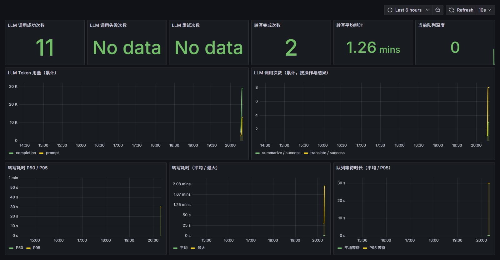
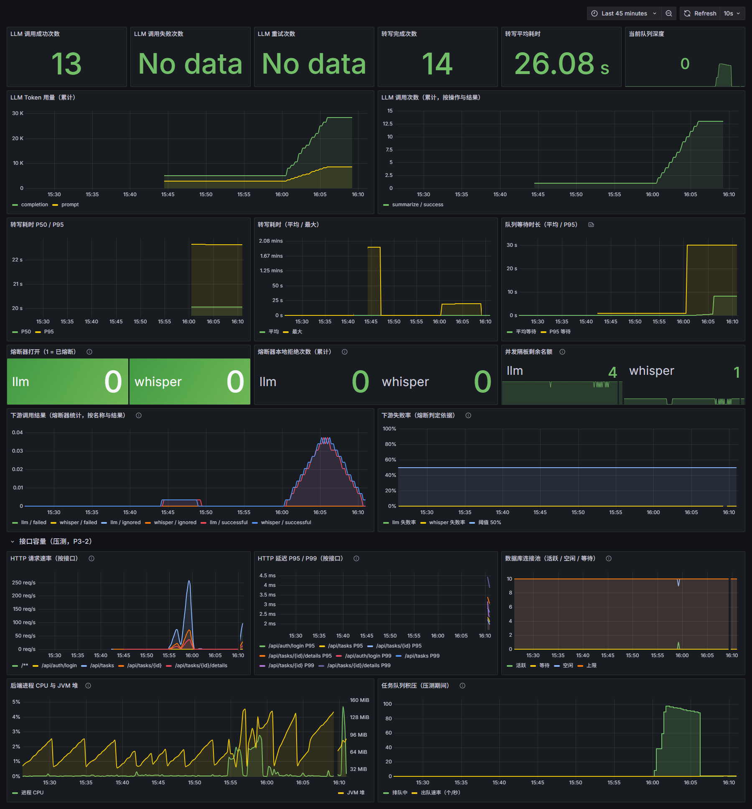

# 可观测性

后端通过 Spring Boot Actuator + Micrometer 暴露运行指标，由 Prometheus 抓取、Grafana 看图。

## 端点

| 端点                                 | 说明                                                                      |
| ------------------------------------ | ------------------------------------------------------------------------- |
| `GET /actuator/health`               | 存活探针，容器 healthcheck 使用；`{"status":"UP"}`                        |
| `GET /actuator/prometheus`           | Prometheus 文本格式指标（JVM/HTTP 默认指标 + 下列自定义指标）             |
| `GET /actuator/circuitbreakers`      | 各熔断器的实时状态与计数（`state` / `failureRate` / `notPermittedCalls`） |
| `GET /actuator/circuitbreakerevents` | 熔断器状态变迁事件流（何时打开、何时半开、何时恢复）                      |

四个端点都在 `SecurityConfig` 中放行，**无需令牌**（取舍见本节末尾）。

## 自定义指标

埋点集中在 `WorkbenchMetrics`，业务代码只调它的方法、不直接依赖 `MeterRegistry`；标签刻意避开任务 id、文件名等高基数维度。

| 类别         | Micrometer 名                       | Prometheus 名                              | 含义                                                                                                                 | 标签                                                                                                 | 打点位置                           |
| ------------ | ----------------------------------- | ------------------------------------------ | -------------------------------------------------------------------------------------------------------------------- | ---------------------------------------------------------------------------------------------------- | ---------------------------------- |
| 转写耗时     | `workbench.transcription.duration`  | `workbench_transcription_duration_seconds` | 单条任务 Whisper 转写（含片段落库）耗时直方图                                                                        | `outcome=success/failure`                                                                            | `TaskService.transcribe`           |
| LLM 调用结果 | `workbench.llm.requests`            | `workbench_llm_requests_total`             | 每次 LLM HTTP 调用按结果计数                                                                                         | `operation=summarize/translate`、`outcome`                                                           | `LlmClient.send`（`finally` 记账） |
| LLM 重试次数 | `workbench.llm.retries`             | `workbench_llm_retries_total`              | 摘要生成在单条任务内首次之外的重试次数（最多 3 次尝试）                                                              | `operation`                                                                                          | `TaskService.generateContent`      |
| 模型降级次数 | `workbench.llm.fallbacks`           | `workbench_llm_fallbacks_total`            | 主模型失败后升级到备用模型的次数                                                                                     | `operation`、`reason=http_400/timeout/io_error/schema_violation/empty_content/invalid_json`          | `LlmClient.requestJson`            |
| 输出结构失败 | `workbench.llm.output_failures`     | `workbench_llm_output_failures_total`      | 模型输出不可用（空内容 / 非法 JSON / 不符合 schema）的次数，即结构失败率                                             | `operation`、`reason=empty_content/invalid_json/schema_violation`                                    | `LlmClient.callOnce`               |
| 校验拦截次数 | `workbench.llm.validation_failures` | `workbench_llm_validation_failures_total`  | 结果校验拦下未通过模型输出的次数（反幻觉闸门命中）                                                                   | `reason=quote_mismatch` / `quote_missing` / `invalid_chapter_*` 等                                   | `TaskService.generateContent`      |
| token 用量   | `workbench.llm.tokens`              | `workbench_llm_tokens_total`               | 从 LLM 响应 `usage` 字段累加的 token 数（同时落库到 `llm_calls`，见「提示词版本化与成本核算」）                      | `type=prompt/completion`、`model`                                                                    | `LlmClient.recordUsage`            |
| 队列深度     | `workbench.queue.depth`             | `workbench_queue_depth`                    | 当前排队等待处理的任务数（Gauge），读自 broker 的真实积压量；broker 不可达时为 `-1`                                  | 无                                                                                                   | `RabbitTaskQueue` 构造函数绑定     |
| 队列等待时长 | `workbench.queue.wait`              | `workbench_queue_wait_seconds`             | 任务从入队到真正开始执行的等待时长直方图（取消息 `timestamp`）                                                       | 无                                                                                                   | `TaskQueueConsumer.handle`         |
| 投递失败次数 | `workbench.queue.publish_failures`  | `workbench_queue_publish_failures_total`   | broker 确认（publisher confirm）未成功返回的次数                                                                     | 无                                                                                                   | `RabbitTaskQueue.publish`          |
| 退避重试次数 | `workbench.queue.retries`           | `workbench_queue_retries_total`            | 瞬时故障后安排退避重试的次数                                                                                         | `reason=whisper_unavailable/database_unavailable/llm_unavailable`、`attempt`（即将进行的第几次尝试） | `TaskQueueConsumer.retryLater`     |
| 死信任务数   | `workbench.queue.dead_letters`      | `workbench_queue_dead_letters_total`       | 超过重试上限、转入死信队列留档的任务数（需要人工处理）                                                               | `reason`                                                                                             | `TaskQueueConsumer.deadLetter`     |
| 任务领取结果 | `workbench.task.claims`             | `workbench_task_claims_total`              | 每次投递的领取结果，`claimed` 才算真正执行、`skipped` 是被判重复投递而丢弃；同一任务无论投递多少次只有一次 `claimed` | `result=claimed/skipped`                                                                             | `TaskService.process`              |
| 租约回收次数 | `workbench.task.lease_reclaims`     | `workbench_task_lease_reclaims_total`      | 租约过期被收回重投的任务数（持有者崩溃才会发生，用于观测失联与恢复）                                                 | 无                                                                                                   | `TaskLease.reclaimExpired`         |

下表的指标由 `resilience4j-micrometer` 自动导出，名字不是本项目起的，但它是判断「下游到底挂没挂」最直接的入口：

| Micrometer 名                                        | Prometheus 名                                           | 含义                                                                                                          | 标签                                                   |
| ---------------------------------------------------- | ------------------------------------------------------- | ------------------------------------------------------------------------------------------------------------- | ------------------------------------------------------ |
| `resilience4j.circuitbreaker.state`                  | `resilience4j_circuitbreaker_state`                     | 熔断器状态，`closed/open/half_open/disabled/forced_open/metrics_only` 各一条 Gauge，值 `1` 表示当前处于该状态 | `name=llm/whisper`、`state`                            |
| `resilience4j.circuitbreaker.calls`                  | `resilience4j_circuitbreaker_calls_seconds`             | 放行调用的耗时与结果（Summary，`_count` 即次数）                                                              | `name`、`kind=successful/failed/not_permitted/ignored` |
| `resilience4j.circuitbreaker.failure.rate`           | `resilience4j_circuitbreaker_failure_rate`              | 当前窗口内的失败率；`-1` 表示样本数还没到 `minimum-number-of-calls`，暂不判定                                 | `name`                                                 |
| `resilience4j.circuitbreaker.not.permitted.calls`    | `resilience4j_circuitbreaker_not_permitted_calls_total` | 被熔断器挡下、**没有发出请求**的调用数                                                                        | `name`、`kind=not_permitted`                           |
| `resilience4j.bulkhead.available.concurrent.calls`   | `resilience4j_bulkhead_available_concurrent_calls`      | 并发隔板剩余名额，降到 `0` 表示该下游并发已满、新调用会被本地拒绝                                             | `name`                                                 |
| `resilience4j.bulkhead.max.allowed.concurrent.calls` | `resilience4j_bulkhead_max_allowed_concurrent_calls`    | 并发隔板容量                                                                                                  | `name`                                                 |

- **熔断计数口径**：熔断器按**一次业务请求**（`requestJson`）计数，而一次 `requestJson` 内部主模型失败后还会再试备用模型，
  所以 `workbench_llm_requests_total{outcome="failure"}` 通常是 `resilience4j_circuitbreaker_calls_seconds_count{kind="failed"}`
  的 **2 倍**，两个数字不能混着读。判断「有没有真的打过去」要看 `not_permitted_calls_total` 是否增长、
  而 `workbench_llm_requests_total` 是否**停住**。
- **隔板饱和没有计数器**：Resilience4j 只导出剩余名额，不导出 rejected 计数，饱和只能靠
  `available_concurrent_calls` 归零来判断（已如实写进 README 限制）。
- **usage 解析**：`LlmClient` 原实现只取 `choices[0].message.content`，**并不解析 `usage`**；先前补上 `usage.prompt_tokens` / `usage.completion_tokens` 的读取并累加到指标，现在同一处还会按「任务 + 提示词版本 + 实际模型」写进 `llm_calls` 表，用于单视频成本导出。
- **队列深度来自 broker**：`WorkbenchMetrics.bindQueueDepth(Supplier<Number>)` 由 `RabbitTaskQueue` 注入数据源，用 `AmqpAdmin.getQueueProperties` 被动读取队列积压量。读不到时返回 `-1`（并在状态翻转时打一条 WARN），而不是回落成 `0`——把「broker 不可达」伪装成「队列为空」会让人误判系统健康。
- **投递失败只打点与记日志**：`publish` 抛异常时任务保持 `QUEUED` 并把错误提示交回调用方（导入接口返回 503，任务仍在），异步拒收（broker 收下了但未确认）只计 `workbench.queue.publish_failures` 并记 ERROR 日志，**不自动重投**，依赖服务启动时的恢复重投兜底（这个取舍在 README 限制里如实标明）。

## 启动与看图

```bash
docker compose up -d --wait      # backend / frontend / mysql / prometheus / grafana 全部 healthy
```

- Prometheus：<http://localhost:9090>，抓取任务 `video-workbench-backend`，目标 `backend:8080/actuator/prometheus`（容器网络内，无需令牌）。
- Grafana：<http://localhost:3000>，默认账号 `admin` / `workbench`（可用 `GRAFANA_ADMIN_USER`、`GRAFANA_ADMIN_PASSWORD` 覆盖）。数据源与面板均由 `ops/grafana/provisioning` 自动配置，面板 UID 为 `workbench-observability`。

面板覆盖上述主要指标：LLM 调用成功/失败/重试计数、转写完成次数与平均耗时、当前队列深度，以及 token 用量、LLM 调用次数、转写耗时 P50/P95、队列等待时长四条曲线，另有五个容错面板——熔断器打开、熔断器本地拒绝次数、并发隔板剩余名额、下游调用结果（按名称与结果）、下游失败率（带 50% 阈值线）。（较晚加入的「校验拦截」「模型降级」「输出结构失败」三个计数器尚未画进面板，可在 Prometheus 直接查询。）



上图来自一次**真实业务路径**：对已有任务触发 `retranscribe` 与 `retry` 后，`/actuator/prometheus` 中 `workbench_transcription_duration_seconds_count{outcome="success"}=2`、`workbench_llm_requests_total{operation="summarize",outcome="success"}=3`、`workbench_llm_tokens_total{type="prompt"}=12690`、`{type="completion"}=29117`，抓取瞬间 `workbench_queue_depth=2`。图中「LLM 调用失败次数」「LLM 重试次数」显示 `No data`，是因为这次运行确实没有失败或重试（该 Counter 只在首次发生时才注册）。为验证这两条路径，另做了一次**故障注入**：把 `LLM_API_KEY` 临时置为无效值后重试任务，得到 `workbench_llm_requests_total{outcome="failure"}=3`、`workbench_llm_retries_total{operation="summarize"}=2`，随后已恢复真实密钥：


下图是**熔断器打开时**的同一块面板（把容器 `LLM_BASE_URL` 指向连接立即被拒的地址后重试任务）：
从上往下第三行起是新增的容错面板，「熔断器打开」里 `llm` 为 `1`（红）、`whisper` 为 `0`（绿），
本地拒绝 `llm` 累计 6 次，隔板剩余名额 `llm 4 / whisper 1`，右下角失败率曲线打到 100% 并压在 50% 阈值线上：


压测那一轮的同一块面板（时间范围取最近 30 分钟，否则尖峰会被默认的 6 小时窗口压平）。最后一行
「接口容量（压测，P3-2）」从左到右是 HTTP 请求速率（按接口）、HTTP 延迟 P95/P99（按接口）、数据库连接池、
后端进程 CPU 与 JVM 堆、任务队列积压——队列积压那条线正是 P3-2 的结论：上传 2 次/秒期间积压线性涨到 **97**，
而读接口的延迟曲线保持平直：



复现截图：`npm run screenshot:grafana`（默认写入 `docs/images/可观测性面板.png`，可传文件名参数；
面板变多后截图需要更高的视口，可用 `GRAFANA_VIEWPORT_HEIGHT=1500` 覆盖默认的 660；
近窗口证据可用 `GRAFANA_RANGE_FROM=now-30m` 覆盖默认的 `now-6h`）。

## 鉴权取舍（如实说明）

`/actuator/health`、`/actuator/prometheus`、`/actuator/circuitbreakers` 与 `/actuator/circuitbreakerevents`
当前**未做鉴权**，任何能访问后端端口的人都能读取指标与熔断状态。
这是为了让 compose 网络内的 Prometheus 直接抓取而做的取舍：这些数据不包含视频内容或密钥，
但包含调用量、耗时、token 用量与队列状态等运营信息。**真实部署应把这些端点限制在内网**，
或用反向代理 / 抓取侧鉴权（如只允许 Prometheus 网段访问、加 Basic Auth），不要直接暴露到公网。
