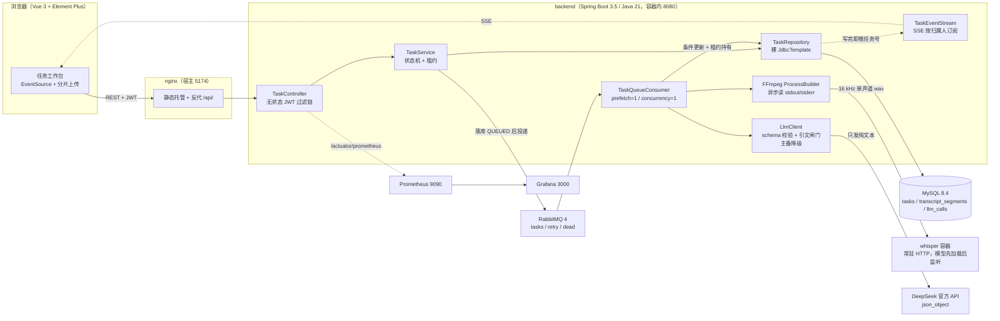

# 架构与取舍

一页看图，再用 ADR 记下每个关键取舍的代价。事实与数字都来自本仓库的实测记录（见
[端到端验收记录](端到端验收记录.md)、[开发验证](开发验证.md)），凡是没测过的一律标明。

## 全链路

一次导入的完整调用链：

1. `POST /api/tasks`（或分片上传的 `complete`）校验归属与文件后落库 `QUEUED`、把原文件写进 `video-storage` 卷，再投递队列；broker 不可用时返回 503 并保持 `QUEUED`。
2. 消费者用 `claimForProcessing`（`where id=? and status='QUEUED' and cancelled=false`）领取，同时写入 `locked_by` 与 `lease_expires_at`；领取失败即视为重复投递，直接 ack 跳过。
3. `ProcessBuilder` 起 FFmpeg 抽音频，stdout/stderr 异步读走、超时终止；WAV 交给 whisper 容器的 `POST /transcribe`。
4. 转写片段入库；随后 LLM 出摘要/要点/章节——提示词里带 schema 原文，返回体先过 schema 再过 `ResultValidator`（时间轴 + 引文逐字核验），不通过就带着失败原因重生成。
5. 每次写状态都触发 `TaskEventStream.taskChanged(taskId)`，SSE 把任务号推给归属人；前端按自己已鉴权的接口重新取数。

## ADR

### ADR-1 持久层用裸 `JdbcTemplate`，不用 JPA

- **决策**：表结构由 Flyway 显式管理，SQL 写在 `TaskRepository` 里，结果手工映射。
- **为什么**：本项目的读写路径少而固定，但需要 `for update skip locked`、条件更新、
  `(created_at, id)` 元组键集分页这三类 JPA 表达起来别扭的操作。
- **代价与替代方案**：省掉 ORM 的隐式查询，换来手写 SQL 与手工映射的重复；复杂领域模型会明显吃亏。
  项目规模小、瓶颈在外部进程（Whisper/LLM）而不是 SQL 生成，所以这个交换成立。

### ADR-2 任务队列：先进程内，后外置 RabbitMQ

- **决策**：从 `ThreadPoolExecutor(1,1)` + `ArrayBlockingQueue` 改为「先落库 `QUEUED` → 投递 RabbitMQ」。
- **为什么**：进程内队列重启即丢，且队列满时任务无法恢复。
- **代价与替代方案**：多一个 broker 组件与投递失败路径（导入返回 503、异步拒收打点）。
  实测已经把「停机期间投递 3 条重复消息」跑通：重启后只执行 1 次，说明外置的代价被幂等裁决点兜住了。

### ADR-3 幂等裁决点放在数据库条件更新，不靠队列去重

- **决策**：唯一裁决点是 `claimForProcessing` 的条件更新，队列不做去重。
- **为什么**：消息可能被重复投递（重试、DLX 回送、人工重投），只有数据库能给出全局唯一的「谁领到了」。
- **代价与替代方案**：每类状态迁移都要写成条件更新；换来的好处是幂等定义集中在一处、可单测。
  代价是没有 fencing token —— 见 [当前不支持与下一步](#当前不支持与下一步)。

### ADR-4 失败分流放在抛出点，退避不占线程

- **决策**：`TransientFailure`（`whisper_unavailable` / `database_unavailable`）由抛出点分类；
  退避延迟写在重试消息的 `expiration` 上，进 `workbench.tasks.retry`，TTL 到期由 DLX 送回主队列。
- **为什么**：按错误字符串匹配分类过不了「哪次失败算可重试」这一关；`Thread.sleep` 退避会占住
  唯一的消费线程，长间隔时把整个消费侧堵死。
- **代价与替代方案**：per-message TTL 只在队头判定，最坏多等一个间隔（实测约 20s）；
  重试过程对排障不直观，要靠日志与队列深度观察。

### ADR-5 多实例用租约持有，不上 Redis 分布式锁

- **决策**：`locked_by` + `lease_expires_at`，心跳只续内存里真正在跑的任务，巡检收回过期租约。
- **为什么**：只为「谁在跑」引入一个 Redis 组件不划算，而数据库本来就在写路径上；
  单靠 `status='PROCESSING'` 无法区分「别人在跑」与「持有者已死」。
- **代价与替代方案**：持有者与数据库网络分区但仍活着时，回收可能造成一次重复执行；
  彻底消除需要 fencing token。多实例实测（两实例、6 任务、崩溃接管）见 P2-4 记录。

### ADR-6 容错治理：隔板在熔断器外层，且不叠 Retry / TimeLimiter

- **决策**：`DownstreamResilience` 固定为「并发隔板 → 熔断器 → 真实调用」；
  LLM 隔板 4、Whisper 隔板 1；超时交给 HTTP 客户端自身的 `timeout`。
- **为什么**：顺序反过来（熔断在外）时，本地并发拒绝会被记成下游故障，把熔断器白白推向打开；
  重试已经分三层（模型降级链 / 结果校验后重生成 / 队列退避），再套 Resilience4j 的 Retry 会叠加放大；
  TimeLimiter 只能提前返回、藏不住仍在跑的请求。
- **代价与替代方案**：隔板饱和只有单测覆盖（容器消费者 `concurrency=1` 压不满），
  且 Resilience4j 不导出 rejected 计数器，只能看 `available_concurrent_calls` 归零。

### ADR-7 LLM 结构化输出走 `json_object` + 本地 schema 校验

- **决策**：`response_format={"type":"json_object"}`，schema 原文既进提示词也进本地校验，
  空内容 / 非法 JSON / 结构不符分别计入 `workbench.llm.output_failures`。
- **为什么**：实测 DeepSeek 官方 API 对 `json_schema`（strict）返回 400
  `This response_format type is unavailable now`，强制 function calling 返回 400
  `Thinking mode does not support this tool_choice`——供应商侧约束拿不到。
- **代价与替代方案**：约束力弱于原生结构化输出，所以「schema + 业务校验」两道理性未必够，
  才又加了引文闸门（ADR-8）。改造前后对比只在同一批 20 条原始输出上成立，
  **不声称线上真实非法率下降**。

### ADR-8 生成结果自动重试 3 次，与队列退避 4 次分工

- **决策**：模型输出不可用（schema 违规 / 时间轴或引文校验不过）时带着失败原因重新生成，最多 3 次；
  转写类瞬时故障才走队列退避（默认 5s / 10s / 20s，上限 4 次，超限进死信）。
- **为什么**：两者性质不同——前者是「模型这次没写好，换个采样再来」，后者是「下游不可用，等一会再试」；
  混在一起会让模型重试把队列重试额度吃掉。
- **代价与替代方案**：一个任务最坏要发起 3 次完整 LLM 调用，成本与耗时放大；
  因此用提示词版本 + usage 入库把每次调用都记账，可导出单视频成本。

### ADR-9 实时推送只推任务号，不推数据

- **决策**：`GET /api/tasks/stream`（SSE）只推「某个任务有变化」的信号，客户端按已鉴权接口重新取数。
- **为什么**：推整行数据等于在推送通道上再实现一遍归属校验与序列化，任何一处漏判都会跨账号泄露；
  推任务号则由已有接口兜底，`TaskRepository` 写路径统一触发，没有订阅者时不额外查询。
- **代价与替代方案**：多一次取数往返；客户端要自己做 debounce 合并（实测一次上传 6 次事件合并成 4 次刷新）。
  没有心跳、且 SSE 是单实例内存态，多实例部署推不到别的实例上的浏览器。

### ADR-10 分片会话状态存文件系统，`uploadId` 由元信息派生

- **决策**：`uploadId = sha256(ownerId + 文件名 + 大小)` 前 16 字节；分片按偏移写入
  `storage/uploads/<uploadId>/data.part`，写完才建 `chunk-N.done` 标记。
- **为什么**：派生 id 让「重选同一个文件」天然落到同一会话，客户端不必记住进度，无需建表也无需会话缓存；
  标记最后写，使「有标记」等价于「这片已落盘」。
- **代价与替代方案**：只按同名同大小判定、**不做内容校验**；半截上传**没有 TTL 清理**，
  用户传一半关页面会留下占着磁盘的目录。

### ADR-11 Whisper 容器化：从「CPU 降级」改为「只用 GPU、拿不到就快速失败」

- **决策**：`whisper` 镜像由 compose 用 build args 构建 CUDA 版 torch（`cu124`），容器预留一块
  NVIDIA GPU，`WHISPER_DEVICE=cuda` 显式声明；容器没拿到 GPU 时启动即失败并留下明确报错，
  绝不静默回落 CPU。`healthcheck` 打 `/health`（返回实际 `device`），`restart: unless-stopped` 自愈。
- **为什么**：原先宿主机 Python 进程悄悄死掉只会让后端报 `ConnectException`，容器化解决了自愈；
  但 CPU 转写实测 134 秒视频约 130 s，长视频体验不可接受，而宿主机本来就有 RTX 4060。
  「显式 cuda + 快速失败」优于「auto 回落」：配了 GPU 的机器静默降级成 CPU，用户会误以为在用 GPU。
- **代价与替代方案**：GPU 成了硬依赖——没有 nvidia-container-toolkit 的机器起不了 whisper
  （这是设计行为；紧急时可临时 `WHISPER_DEVICE=cpu`，但镜像仍是 CUDA 版，只大不快）；
  CUDA 镜像比 CPU 版大得多（torch 及 CUDA 运行库约多 2 GB+）。实测（2026-10-03）：
  356 秒中文音频 GPU 转写 40 s，`/health` 与启动日志均报 `cuda`。

---

# 当前不支持与下一步

下面是**实测确认过的边界**，不是「暂未实现」的客气话；被追问时按这里的口径回答。

## 部署与容量

- **只按单实例验证**：SSE 连接表、Resilience4j 的隔板与熔断器状态都在进程内存里，
  多实例部署时浏览器连到哪个实例就只能收到那个实例上的推送；转写侧本来就串行
  （whisper 隔板 1、消费者 `concurrency=1`），多实例只对读接口有意义。
- **没有背压与拒绝策略**：`importVideo` 只受文件大小限制，接口永远很快、broker 积压线性增长
  （实测接收能力是处理能力的 60 倍以上），积压只能靠人工干预。
- **租约回收可能造成一次重复执行**：持有者与数据库网络分区但仍活着时，巡检会收回租约，
  没有 fencing token 拦住原持有者继续写。多实例实测（含 `kill` 接管）未出现重复执行，但这是概率问题。
- **Whisper 只用 GPU，GPU 是硬依赖**：实测（2026-10-03，RTX 4060 Laptop）356 秒中文音频转写 40 s、
  启动日志确认 `turbo on cuda (NVIDIA GeForce RTX 4060 Laptop GPU)`；没有 GPU 的机器起不了 whisper。
  CPU 路径只在 P3-1 验收时实测过（4 秒片段约 10 s、134 秒视频约 130 s，常驻约 3.17 GiB），
  现在 `WHISPER_DEVICE` 改回 `cpu` 理论上仍可用但未回归验证，且镜像仍是 CUDA 版（只大不快）。
- 熔断器状态、租约回收计数等指标**随进程重启清零**，排障要结合日志，不能只看 Grafana。

## 上传与推送

- **推送没有心跳**：中间代理按空闲超时断开时，客户端要等浏览器自己发现断链才重连，
  期间靠 `onerror` 的一次主动刷新兜底，不是实时。
- **半截上传没有 TTL 清理**：用户传一半关页面会留下 `storage/uploads/<id>/` 占着磁盘，目前只靠手工清理。
- **续传只按「同名同大小」判定**：不做内容校验，同名不同内容会续到同一个会话上。
- **CORS 白名单写死本机来源**（`localhost` / `127.0.0.1` 的 `5173`、`5174`），
  没有验证过前端与后端跨域分域部署的拓扑。

## 质量与工程

- **评测只有仓库内的对比**：负例是构造变异，改造前的提示词与真实输出无法完整重构，
  所以不声称「线上真实结构非法率下降 X%」；当前提示词下真实采样 3 次的结构非法率 0/3，样本量本来就小。
- **压测是单机同机跑**：客户端与服务端抢同一份 CPU，上传场景只压接收路径、不是端到端 QPS；
  未做 soak 与读写混合，读接口没压出拐点，因此**不给最大 QPS 结论**。
- **本地没有 MySQL 测试库时 4 项集成测试跳过**（`Skipped: 4`），要完整覆盖得配 `MYSQL_TEST_URL`。
- **没有多租户/团队、配额、审计日志与接口限流**，当前只有「账号 = 一个人」的归属隔离。
- 前端是单个 `App.vue` + `api.ts`，没拆组件也没路由，页面再多要先做重构。

## 下一步

1. 分片会话加 TTL 清理，并把内容哈希纳入 `uploadId`，让续传判定不只看文件名与大小。
2. 给 SSE 加心跳，并明确多实例下的广播方案（或退化为「推送 + 低频兜底轮询」）。
3. 租约加 fencing token，关掉「持有者失联但仍活着」导致的重复执行窗口。
4. 做一次队列背压实验（超过处理能力的到达速率下拒绝或排队上限），把容量结论从「线性增长」变成「可控」。
5. 把 `ResultValidator` 的真实失败样本回流成评测集，让准确率随真实数据迭代而不停在构造负例上。
